# <font color=#69D600>CentOS Install</font>

[TOC]

官网路径：https://www.centos.org/download/

   				http://isoredirect.centos.org/centos/8/isos/x86_64/

网易镜像：http://mirrors.163.com/centos/8.2.2004/isos/x86_64/

#### Version: CentOS-8.1.1911

平台：VMware Workstation 16 Pro

文件：CentOS-8.1.1911-x86_64-dvd1.iso

> note: 官网没有具体文件下载，需要在 download 页面找到 isos 文件夹，从 mirror 链接下载 iso 文件，其实就是阿里云网易搜狐之类的镜像库，可以直接到镜像库找，大部分开源软件都可以在镜像库下载

 


### 开始安装

> Note:
>
> 安装到虚拟机则先创建新虚拟机，通过虚拟机加载镜像安装系统
>
> 安装到硬盘则可以先从本地磁盘分配好空间备用，镜像可以用 U 盘制作启动盘，或刻录到光盘

创建新虚拟机 详见 [VM Virtual Machine.md](./VM Virtual Machine.md)


### 安装系统

#### Install CentOS Linux 8:

 

选择安装，Enter，选择键盘和语言，Continue

 


#### Time & Date:

时区和日期时间配置

 

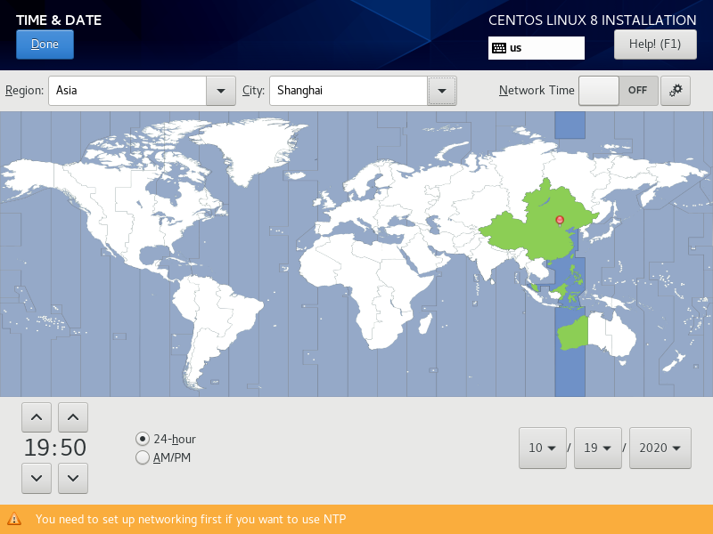 


#### Software Selection:

带图形界面，需要的几个程序

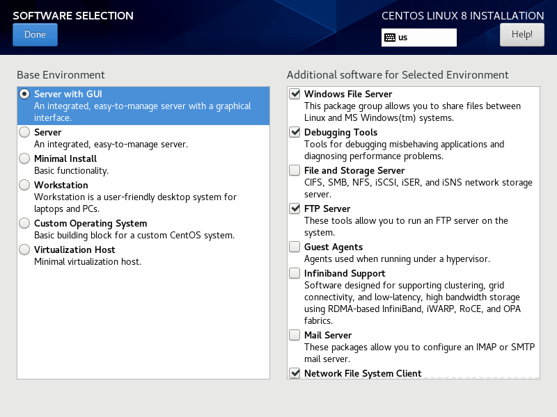 


#### Network & Host Name:

连接网络，主机名称命名

 


#### Installation Destination:

安装位置，虚拟硬盘自定义分区

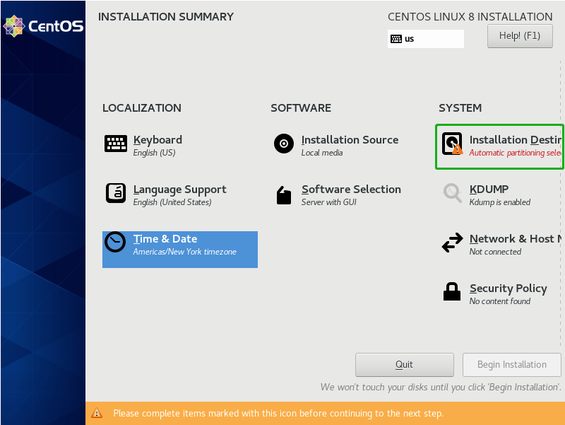 

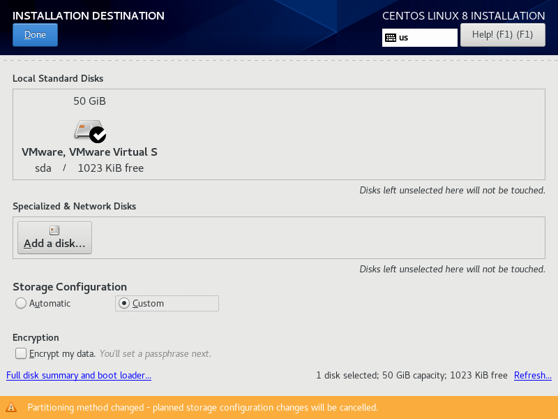 

分区配置

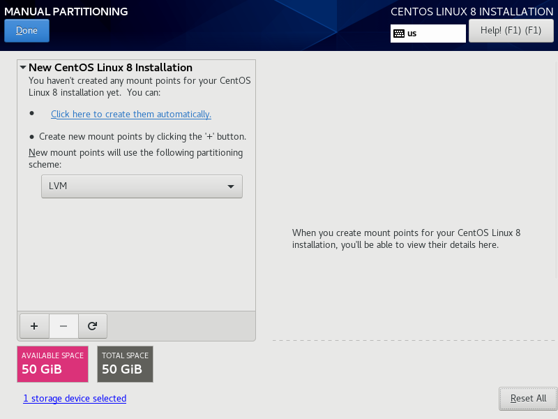 

添加挂载点

 

先把分区加上，容量随便，稍后再更改

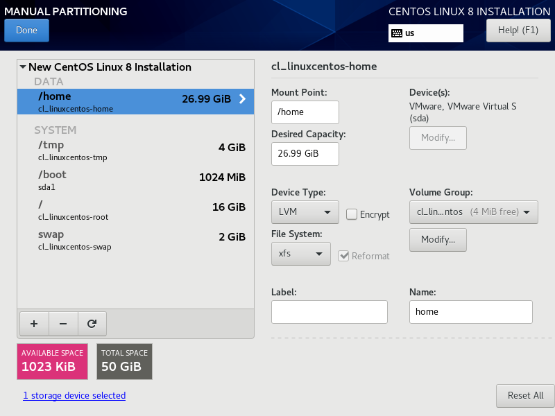 

从配置上看主要有 DATA 和 SYSTEM 两个区域，先按以下方案进行了配置

```
分区		大小		文件系统
/boot	1G		ext4
/		16G		xfs
/tmp	4G		xfs
swap	2G		xfs
/home	26.99G	xfs
```

有点奇怪有 1M 空间没有被分配，不清楚被什么文件占用了或是不是预留给某个文件了

/boot 暂时给了 1G，服务器好像 200M 就足够，系统启动文件并不是很大，后面查看也只有 144M

```
/dev/sda1 	976M  144M  766M  16% /boot
```

配置完成，Accept Changes

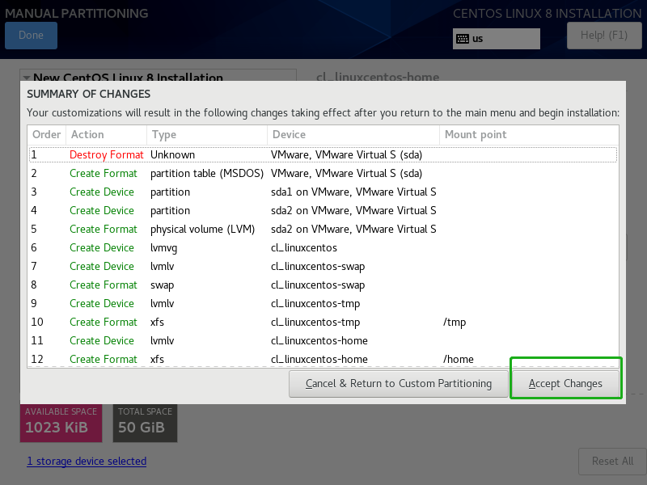 

开始安装

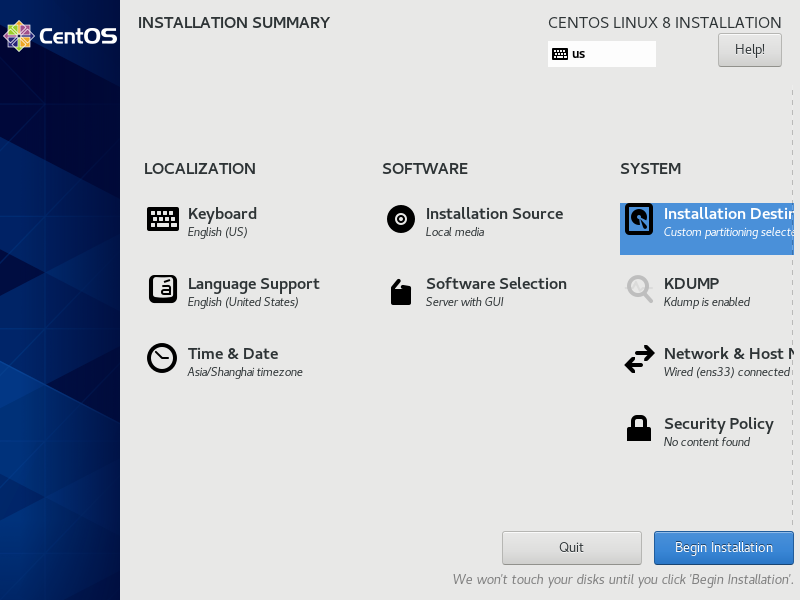 

安装过程同时把密码设好，反正迟早要设置

 

同时添加新用户用来登录系统

 

 

完成重启

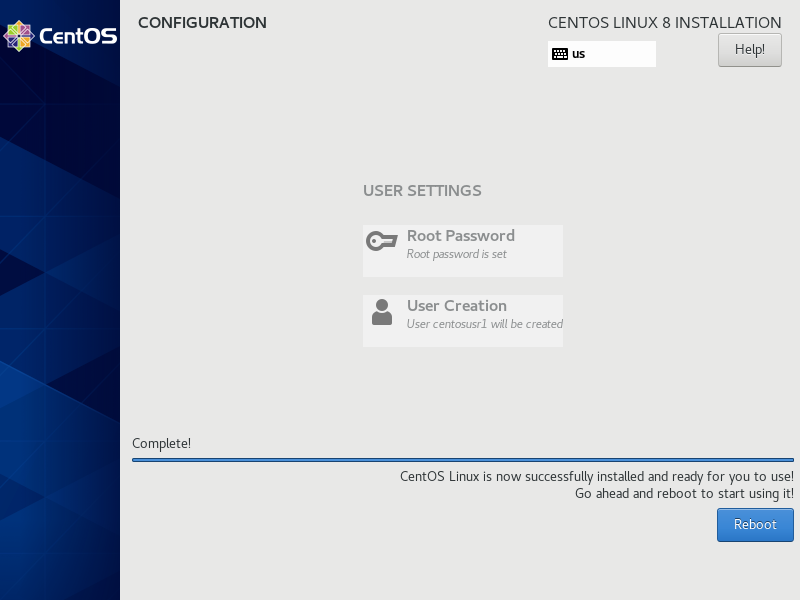 

许可配置

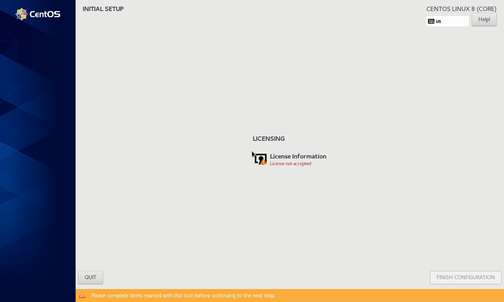 

同意许可

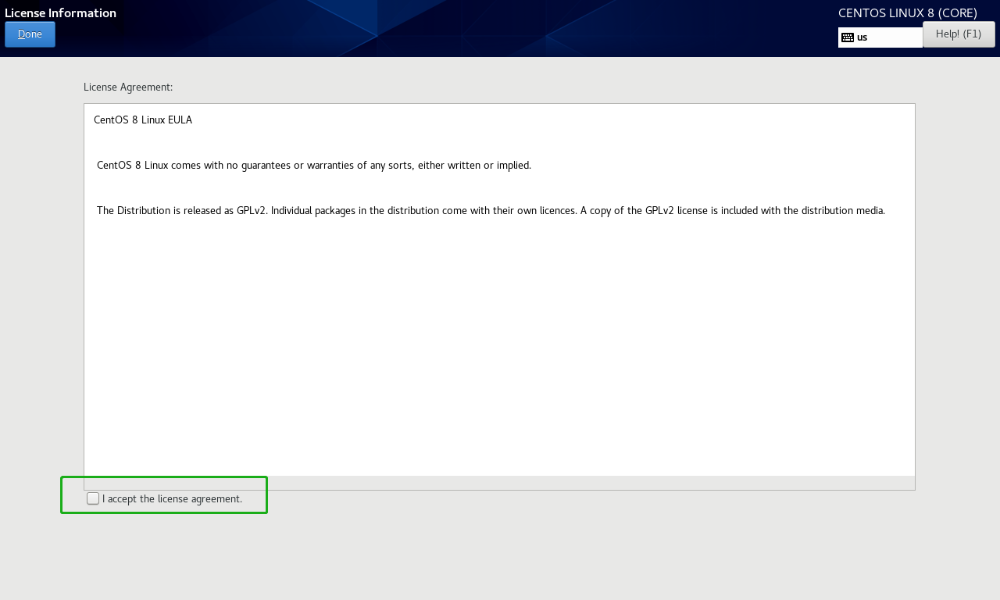 

完成配置

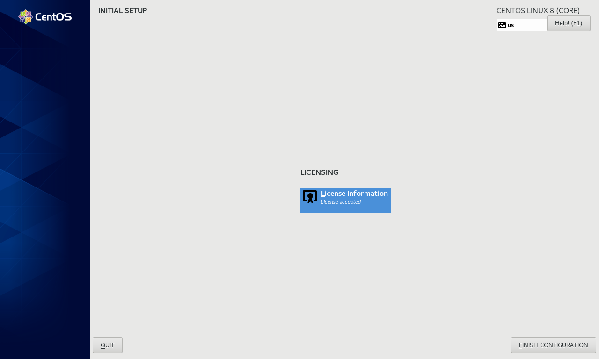 

进入系统

 

Next

 

Next

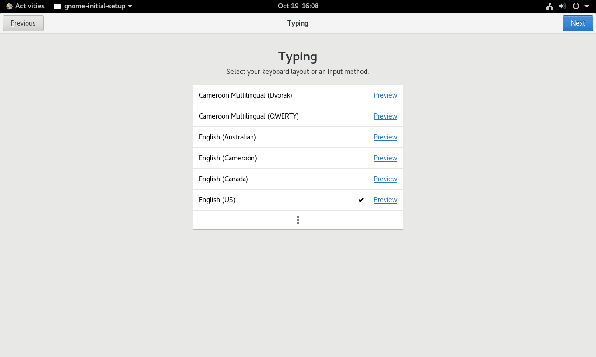 

隐私先开启，Next

 

帐户没有，Skip

 

完成

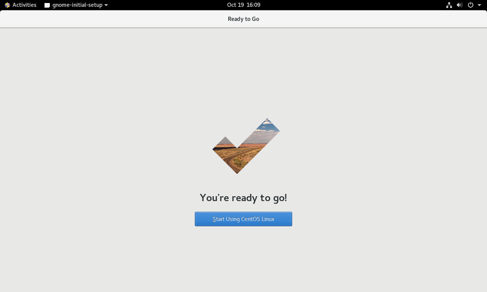 


### 检测

打开终端，df -h

 

```
$ df -h
Filesystem                       Size  	Used 	Avail	Use% Mounted on
devtmpfs                         886M   0  		886M   	0% 	/dev
tmpfs                            904M   0  		904M   	0% 	/dev/shm
tmpfs                            904M  	9.7M  	894M   	2% 	/run
tmpfs                            904M   0  		904M  	0% 	/sys/fs/cgroup
/dev/mapper/cl_linuxcentos-root  16G  	4.9G   	12G  	31% /
/dev/mapper/cl_linuxcentos-home  27G  	241M   	27G   	1% 	/home
/dev/mapper/cl_linuxcentos-tmp   4.0G   62M  	4.0G  	2% 	/tmp
/dev/sda1                        976M  	144M  	766M  	16% /boot
tmpfs                            181M  	1.2M  	180M   	1% 	/run/user/42
tmpfs                            181M  	4.6M  	177M   	3% 	/run/user/1000
/dev/sr0                         7.1G  	7.1G    0 		100% /run/media/usr1/CentOS-8-1-1911-x86_64-dvd
```

swap 大小似乎有出入，目录也比较多，不清楚

```
/boot	1G		ext4	// /boot
/		16G		xfs		// /
/tmp	4G		xfs		// /tmp
swap	2G		xfs		// /dev /run /sys/fs/cgroup
/home	26.99G	xfs		// /home
```

```
bin -> usr/bin		/
boot				/
dev				
etc					/
home				/home
lib -> usr/lib		/
lib64 -> usr/lib64	/
media				/
mnt					/
opt					/
proc				/proc
root				/
run				
sbin -> usr/sbin	/
srv					/
sys				
tmp					/tmp
usr					/
var					/
```


### 相关问题追查解决备注
系统安装时语言选的 English，/usr/lib/locale 也是 en_US，locale 命令查看却是 zh_CN.UTF-8，可能是因为时区 **Time & Date** 选了 Shanghai

```
# locale
locale: Cannot set LC_CTYPE to default locale: No such file or directory
locale: Cannot set LC_MESSAGES to default locale: No such file or directory
locale: Cannot set LC_ALL to default locale: No such file or directory
LANG=zh_CN.UTF-8
LC_CTYPE="zh_CN.UTF-8"
LC_NUMERIC="zh_CN.UTF-8"
LC_TIME="zh_CN.UTF-8"
LC_COLLATE="zh_CN.UTF-8"
LC_MONETARY="zh_CN.UTF-8"
LC_MESSAGES="zh_CN.UTF-8"
LC_PAPER="zh_CN.UTF-8"
LC_NAME="zh_CN.UTF-8"
LC_ADDRESS="zh_CN.UTF-8"
LC_TELEPHONE="zh_CN.UTF-8"
LC_MEASUREMENT="zh_CN.UTF-8"
LC_IDENTIFICATION="zh_CN.UTF-8"
LC_ALL=            
```

临时解决方案：

export LC_ALL=en_US.UTF-8

export LANG=en_US.UTF-8

```
# export LC_ALL=en_US.UTF-8
# locale
LANG=zh_CN.UTF-8
LC_CTYPE="en_US.UTF-8"
LC_NUMERIC="en_US.UTF-8"
LC_TIME="en_US.UTF-8"
LC_COLLATE="en_US.UTF-8"
LC_MONETARY="en_US.UTF-8"
LC_MESSAGES="en_US.UTF-8"
LC_PAPER="en_US.UTF-8"
LC_NAME="en_US.UTF-8"
LC_ADDRESS="en_US.UTF-8"
LC_TELEPHONE="en_US.UTF-8"
LC_MEASUREMENT="en_US.UTF-8"
LC_IDENTIFICATION="en_US.UTF-8"
LC_ALL=en_US.UTF-8
# export LANG=en_US.UTF-8
```

优选解决方案：

```
// 查看 locale.conf 文件
# cat /etc/locale.conf
// en_US 则正常，zh_CN 需要修改为 en_US
LANG="en_US.UTF-8"

// 加载配置文件即生效，仅当前登录有效，重启变无效。亦可用 . /etc/locale.conf 命令
# source /etc/locale.conf

// root 用户在 /etc/profile.d/ 添加 locale.sh，系统启动会自动加载
# cat > /etc/profile.d/locale.sh
. /etc/locale.conf
```


### DONE


