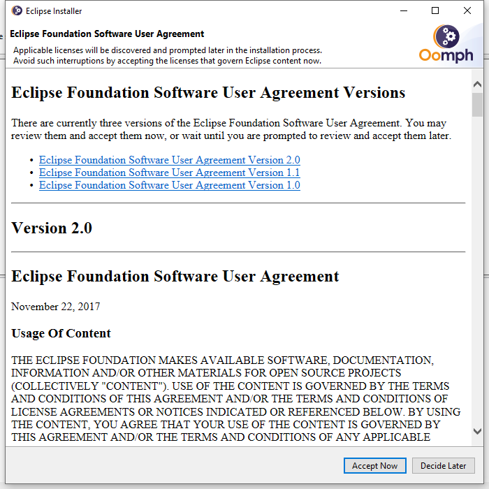

# Eclipse Install

[TOC]

官网下载 ：https://www.eclipse.org/downloads/

#### Version: jee-2021-06

平台：Windows

文件：eclipse-inst-jre-win64.exe

### 开始安装

#### Ecllipse IDE for Enterprise Java an Web Developers:

选择需要安装的 IDE

 

#### Advance Mode:

默认安装非常简单，新版本默认支持 Java 11+ VM 版本，需要降到 Java 1.8 的安装好后在 References 设置

需要更详细的安装信息可以在菜单选择高级模式

 

#### Product:

高级模式可在 Product Version 选需要安装的 IDE 版本。如不想太麻烦也可以切回简单模式

 

#### Projects:

有三大类项目，具体项目很多，引入 GitHub 的项目需要有 GitHub 帐号密码才能进行下一步

引入项目会在安装目录下生成对应的项目目录，需要下载，使安装更慢。这不是我们想要的，安装软件即可，Next

 

#### Variable:

选择安装目录，Next

 

#### Confirmation:

确认配置没有问题，点击 Finish 进行安装

 

#### Eclipse Foundation Software User Agreement:

这个时候才弹出用户协议，Accept Now

 

#### Progress:

默认安装好后自动运行软件，如不想运行把对应的选项去掉

 

### 检测

#### Eclipse IDE Launcher:

运行选择工作空间

 

可以创建新项目了

 

### 相关问题追查解决备注

暂无

### DONE

