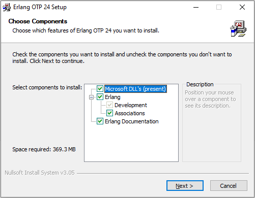
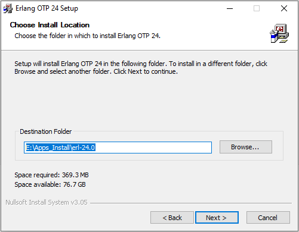
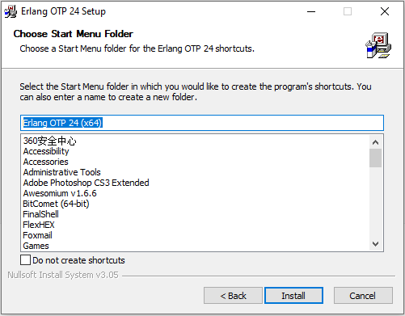
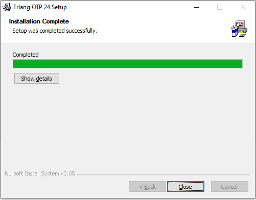

# Erlang Install

[TOC]

官网：https://www.erlang.org/

官网下载：https://www.erlang.org/downloads

#### Version: otp_win64_24.0

平台：Windows

文件：otp_win64_24.0.exe

> 安装过程可能需要安装 C++ 运行库

### 开始安装

#### Choose Components:

组件选择，帮助文档比较占空间，如不需要可以不选

  

#### Choose Install Location:

选择安装目录

 

#### Choose Start Menu Folder:

软件开始菜单目录及快捷方式，根据需要设置

 

#### C++ Runtime:

同意并安装

 

#### Installation Complete:

Completed

 

Finish

### 检测

 

### 相关问题追查解决备注

### DONE

