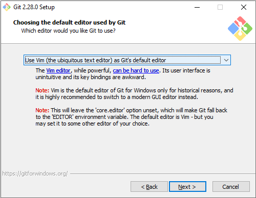
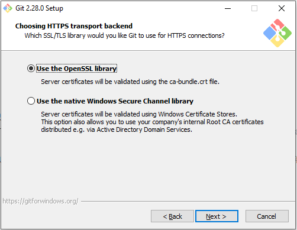
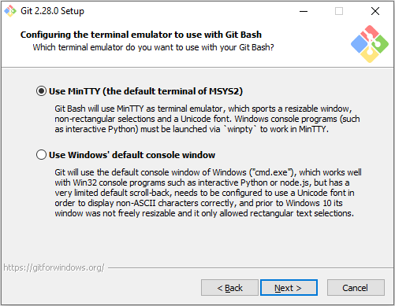
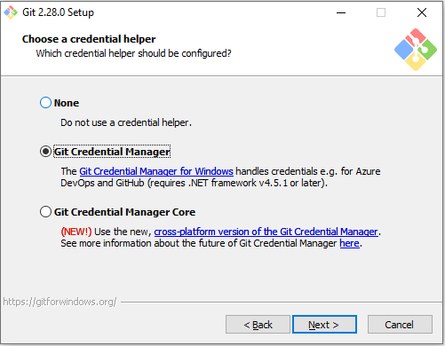
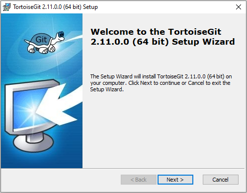
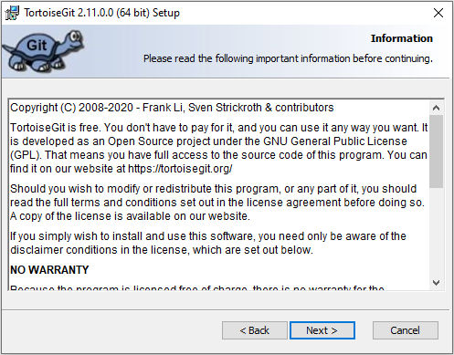
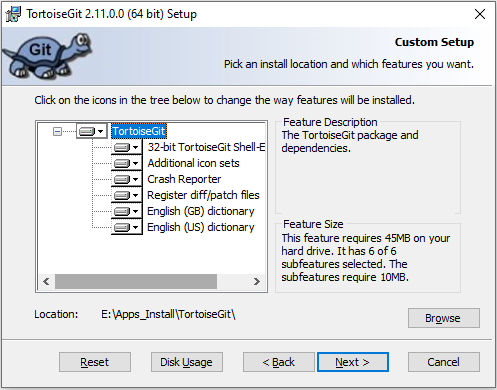
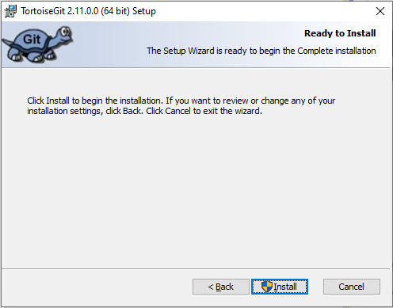
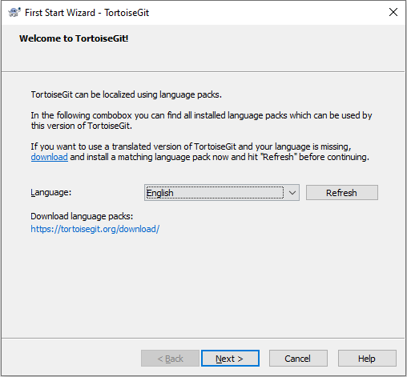

# Git Install

[TOC]

官网下载：https://git-scm.com/downloads
   				https://tortoisegit.org/download/

#### Version: Git-2.28.0-64-bit

平台：Windows

文件：Git-2.28.0-64-bit.exe，TortoiseGit-2.11.0.0-64bit.msi

### 开始安装

先安装 Git，再安装 TortoiseGit

#### Information:

Next

 

#### Select Destination Location:

选择安装路径，Next

 

#### Select Components:

组件默认就行，桌面图标不需要，添加右键菜单，支持大文件，.git* 配置文件和稍后需要选的默认编辑器关联， .sh 文件和 Bash 关联运行，控制台字体不需要，每天检查更新 Git 不需要

Next

 

#### Select Start Menu Folder:

开始菜单文件夹，不需要就 Don't create，Next

 

#### Choosing the default editor used by Git:

暂时都没装，Vim、Notepad++、Sublime Text 都不错，选项也赞了几乎每个软件，看个人喜欢，Next

 

​	**Adjusting your PATH environment:**

​	**Use Git from Git Bash only**：这是最安全的选择，因为你的 PATH 根本不会被修改，你只能使用 Git Bash 的 Git 命令行工具

​	**Use Git from the Windows Command Prompt**：这个选项被认为是安全的，它只向 PATH 添加一些最小的 Git 包，以避免使用可选的 Unix 工具混淆环境。你将能够从 Git Bash 和 Windows 命令提示符中使用 Git 。建议选择此项

​	**Use Git and optional Unix tools from the Windows Command Prompt**：Git 和可选的 Unix 工具都将添加到计算机的PATH中。警告：这将覆盖Windows工具，如“find”和“sort”，只有在了解其含义后才使用此选项

默认就好，Next

 

#### Choosing HTTPS transport backend:

OpenSSL 库和本地 Windows 安全通道库，默认 OpenSSL，Next

 

#### Configuring the line ending conversions:

配置换行符转换，**Windows-style:** CRLF=\r\n，**Unix-style:** LF=\n，Windows系统推荐默认选项，Next

 

#### Configuring the terminal emulator to use with Git Bash:

终端模拟器，默认 MinTTY 即可，Next

 

#### Choose the default behavior of `git pull`:

pull 默认行为 Next

 

#### Choose a credential helper:

凭据助手，默认 Next

 

#### Configuring extra options:

额外选项，文件缓存，Next

 

#### Configuring experimental options:

Git Bash 新支持不通过 winpty 运行诸如 Node/Python 的程序，不过还存在已知 bugs，暂不需要，Install

Finish，继续安装 TortoiseGit

 

Next

 

Next

 

#### Choose SSH Client:

SSH 客户端，默认 Next

 

#### Custom Setup:

选择需要功能，安装路径，Next，Install

 

Finish，汉化，不需要。进入初次运行配置

 

没得选，Next

 

#### Configure git.exe:

默认自动识别 Git 安装路径，如果没有识别，确认先安装 Git，Check now，Next

 

#### Configure user information:

暂时不设置，Next

 

使用时再根据需要设置，Finish

 

### 检测
右键菜单齐全

 

### 相关问题追查解决备注

### DONE

