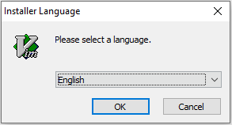
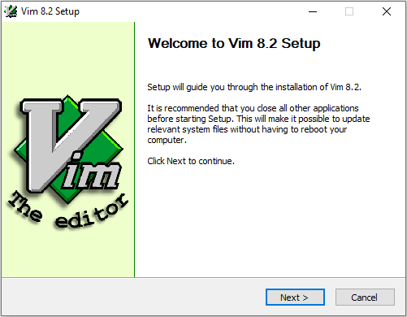
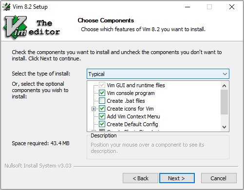
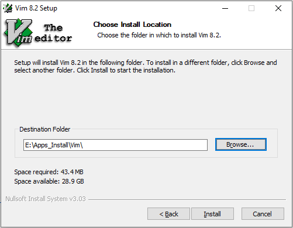
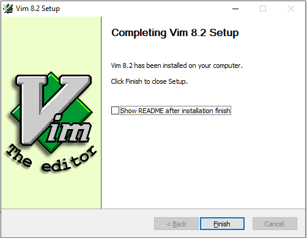

# <font color=#69D600>Gvim Install</font>

[TOC]

官网下载：https://www.vim.org/download.php

#### Version: gvim8.2

平台：Windows

文件：gvim82.exe


### 开始安装

#### Installer Language:

 

Next

 


#### License Agreement:

 


#### Choose Components:

目前需求默认典型安装即可

 


#### Choose _vimrc settings:

目前需求默认配置即可

 


#### Choose Install Location:

选择安装目录

 

Finish

 


### Edit -> Startup Settings

```
set nobackup
syntax enable

"set autoindent
"set cindent

set tabstop=4
set shiftwidth=4

"中文编码settings
set fileencodings=ucs-bom,utf-8,chinese,latin-1,cp936,gbk,gb18030,gb2312,utf-16,big5
set fileencoding=utf-8
set encoding=utf-8
set termencoding=utf-8

if has("win32")
set fileencoding=chinese
else
set fileencoding=utf-8
endif
"解决菜单乱码
source $VIMRUNTIME/delmenu.vim
source $VIMRUNTIME/menu.vim
"解决comsle输出乱码
language messages zh_CN.utf-8
```


### 检测
 


### 相关问题追查解决备注


### DONE


