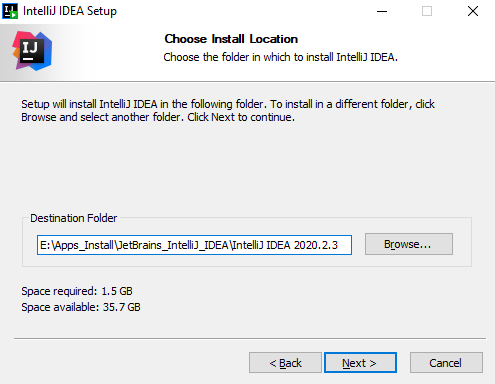
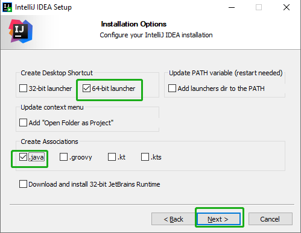
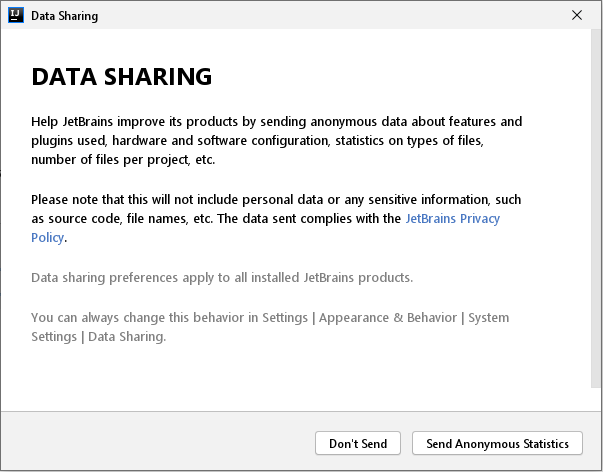
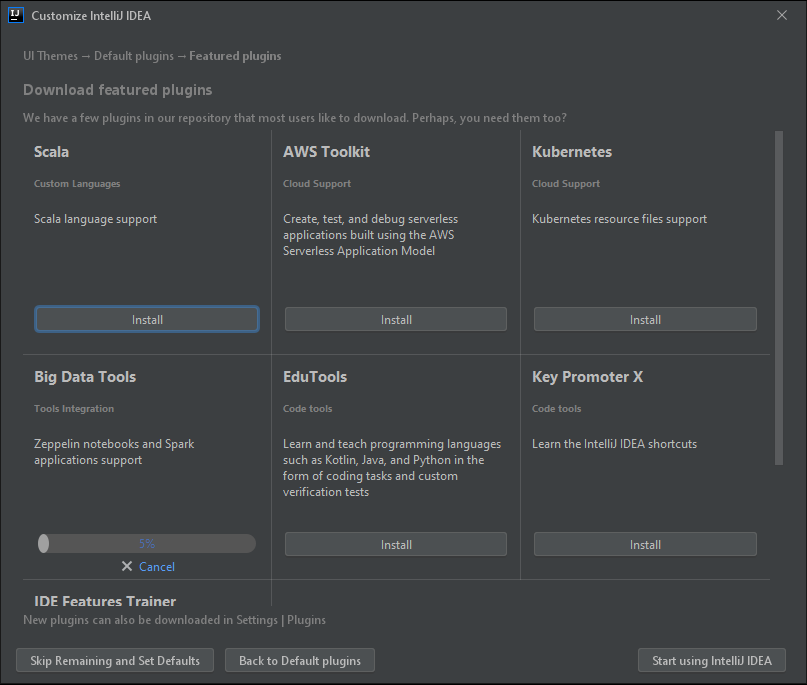
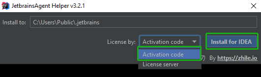

# IntelliJ IDEA Install

[TOC]

官网下载 ：https://www.jetbrains.com/idea/download/#section=windows

​    				https://www.jetbrains.com/idea/download/other.html

#### Version: ideaIU-2020.1

平台：Windows

文件：ideaIU-2020.1.exe

破解文件：IntelliJ jar all.rar

> note: 因破解文件只能破解**2020.1**版本，不是图片最新版，安装过程完全一样的
>
> ​		  破解文件网上很多，这里不提供

### 开始安装

#### Choose Install Location:

选择安装目录，Next

 

#### Installation Options:

安装选项，64位，关联文件选一下吧

 

#### Choose Start Menu Folder:

创建开始菜单文件夹，默认，开始安装等进度完成

 

完成运行

 

### 开始运行

#### JETBRAINS USER AGREEMENT:

同意继续

 

#### DATA SHARING:

数据共享匿名发送？算了Don't Send

 

#### Set UI theme:

UI 主题，风格看自己喜欢

 

#### Default Plugins:

默认插件，默认都开启，可以自定义需要部分或禁用，开发和学习暂时没理由不要，默认 Next

 

#### Featured plugins:

功能插件后面需要再装也可以，开始使用，选试用

 

 

### 破解

打开后新建项目进入可编辑界面，将 **jetbrains-agent.jar** 拖入到程序中，弹框 **Restart**

 

 

#### 激活成功

 

### 检测

### 相关问题追查解决备注

暂无

### DONE

