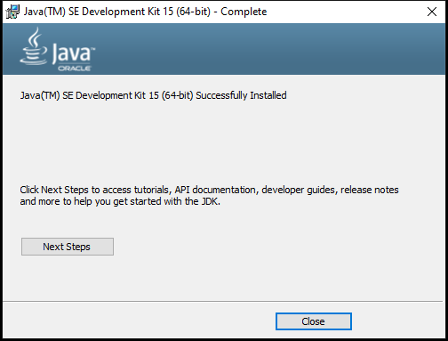
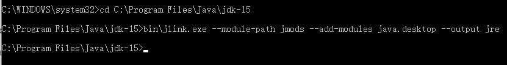
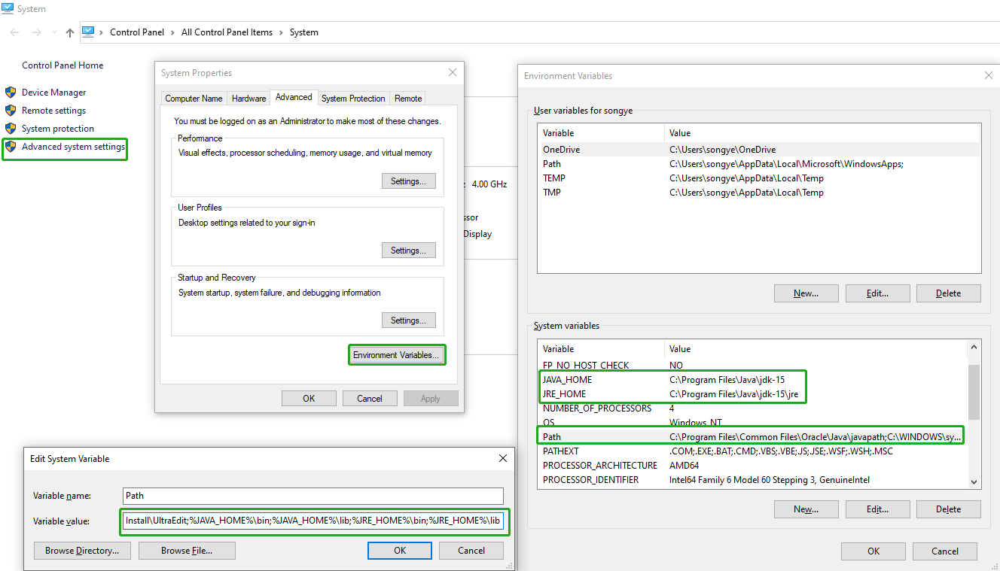
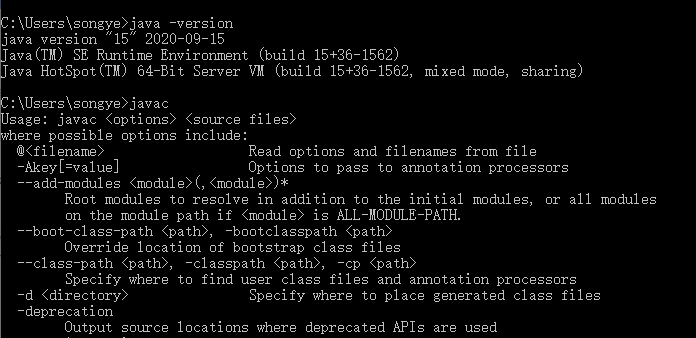

# <font color=#69D600>JDK Install</font>

[TOC]

官网下载：https://www.oracle.com/java/technologies/javase-jdk15-downloads.html

#### Version: jdk-15

平台：Windows

文件：jdk-15.exe


### 开始安装

基本上按默认安装即可，Close

 


#### 环境变量配置

JDK9以上版本没有jre，管理员启动CMD

``` 
 cd C:\Program Files\Java\jdk-15
 bin\jlink.exe --module-path jmods --add-modules java.desktop --output jre
```

 

**JAVA_HOME**

``` 
C:\Program Files\Java\jdk-15
```

**JRE_HOME**

```
C:\Program Files\Java\jdk-15\jre
```

**PATH 变量追加**

```
;%JAVA_HOME%\bin;%JAVA_HOME%\lib;%JRE_HOME%\bin;%JRE_HOME%\lib
```

**CLASSPATH**	// JKD8及以下版本，JDK9版本及以上不再需要配置 **注意**前面的两个符号**[<font color=red>.;</font>]** ，这里不需要配置

```
.;%JAVA_HOME%\lib\dt.jar;%JAVA_HOME%\lib\tools.jar
```


**资源管理器或开始菜单 --> 我的电脑 --> 属性 --> 高级系统设置 --> 环境变量**




### 检测
```
java -version
javac
```

 


### 相关问题追查解决备注
JKD9版本核心变化，模块化系统用于优化加载class文件，不再需要配置CLASSPATH环境变量

至于没有了jre，也是出于优化运行时环境，提供bin\jlink.exe让用户自行生成jre，根据项目需求进行部署和拓展


### DONE


