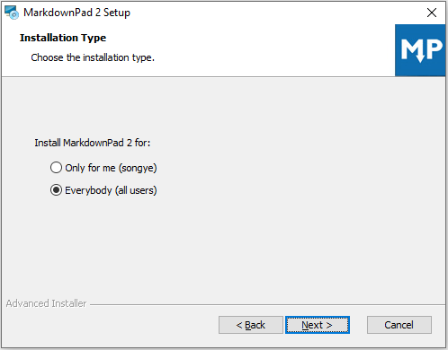
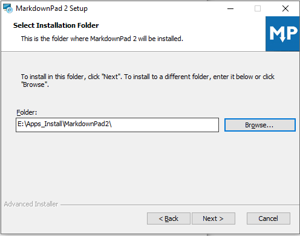
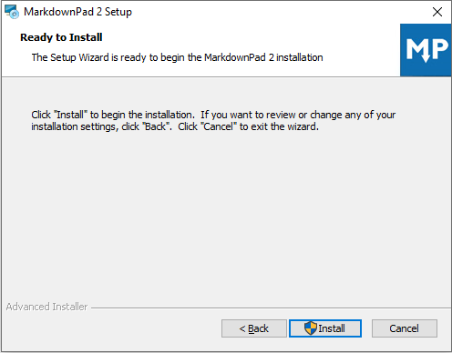
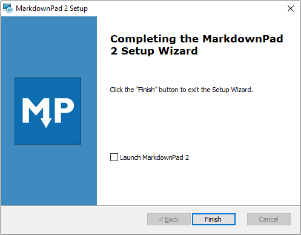
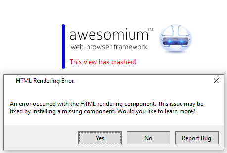
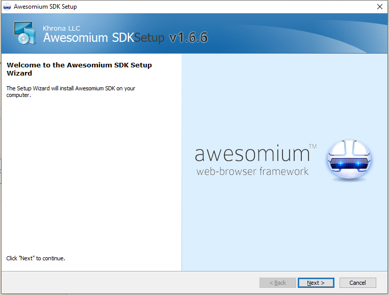

# MarkdownPad Install

[TOC]

官网下载：http://markdownpad.com/download/markdownpad2-setup.exe

#### Version: markdownpad2

平台：Windows

文件：markdownpad2-setup.exe

​			awesomium_v1.6.6_sdk_win.exe	// 预览窗口无法显示则需要安装

### 开始安装

语言选项：English

 

#### Installation Type:

所有用户使用

 

#### End_user License Agreement:

 

#### Select Installation Folder:

 

#### Configure Shortcuts:

 

#### Ready to Install:

 

Finish

 

### Error:

 

预览窗口无法正常显示，点 Yes 进官网技术问题支持，官方推荐尝试安装 Awesomium 1.6.6 SDK，点击连接下载安装

 

 

正常安装，其他步骤忽略，典型安装即可

 

### 检测
编辑、预览窗口正常

### 相关问题追查解决备注

### DONE

