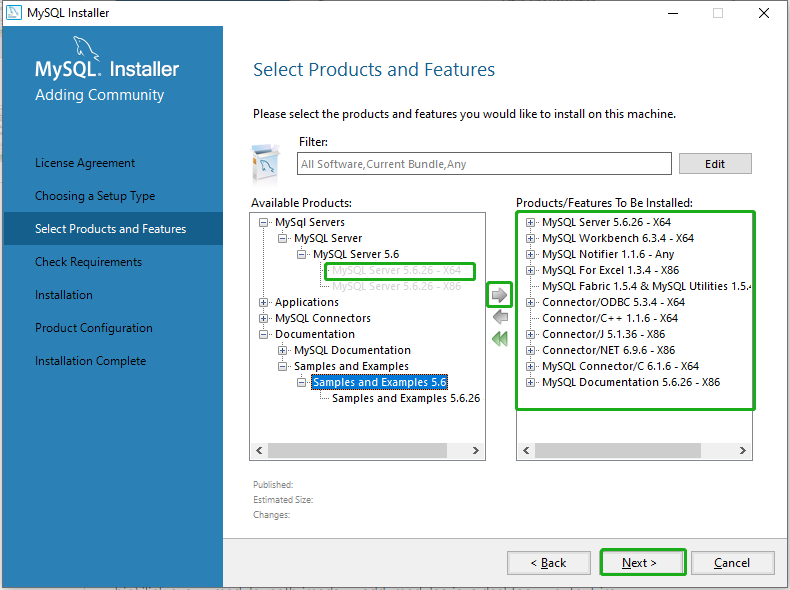
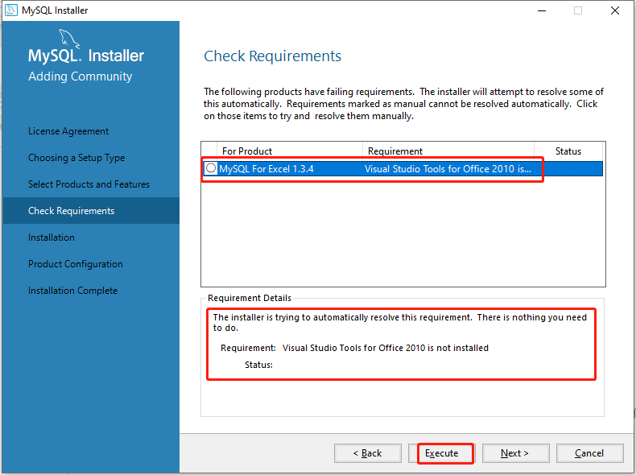
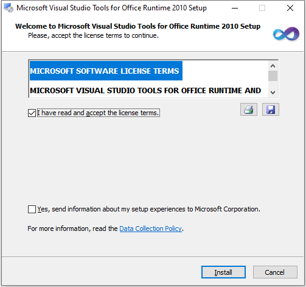
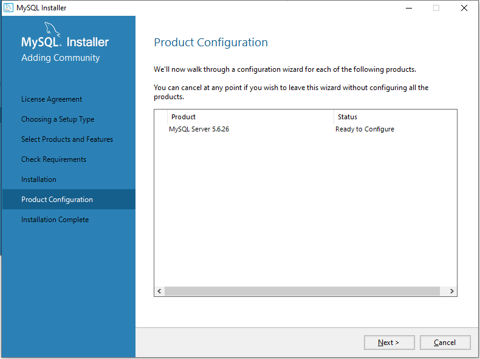
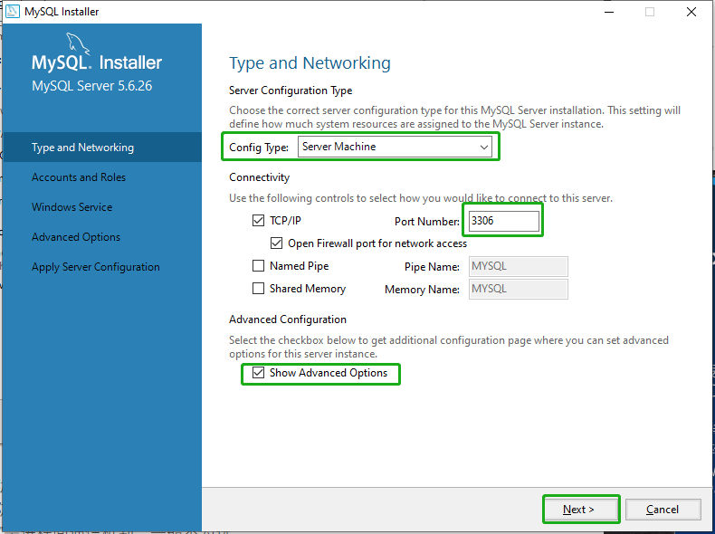
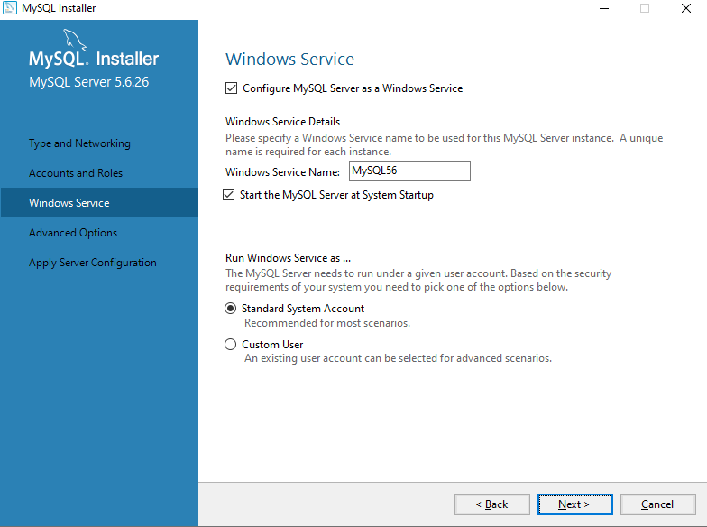
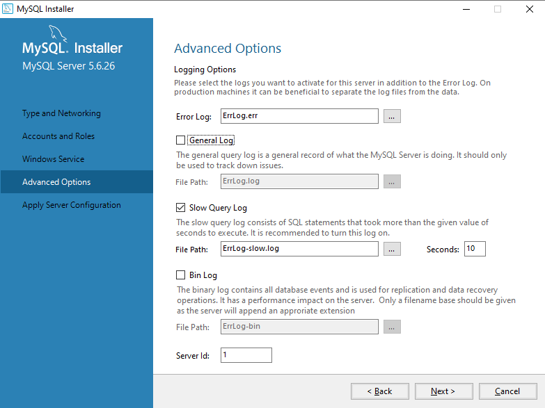
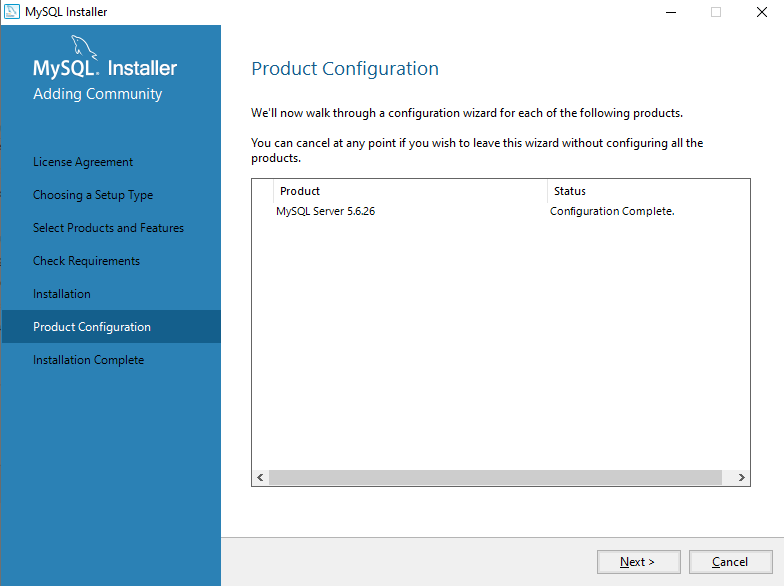
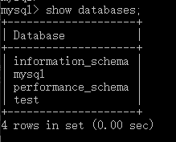

# <font color=#69D600>MySQL Install</font>

[TOC]

搜狐镜像：http://mirrors.sohu.com/

网易镜像：http://mirrors.163.com/

MySQL社区：https://dev.mysql.com/downloads/mysql/

#### Version: mysql-5.6.26-winx64

平台：Windows

文件：mysql-installer-community-5.6.26.0.msi，mysql-5.6.26-winx64.zip，my.ini


> **MySQL Community Server**：社区版。由MySQL开源社区开发者和爱好者提供技术支持，对开发者开放源代码并提供免费下载
>
> **MySQL Enterprise Server**：企业版。包括最全面的高级功能和管理工具，对用户收费。


**之前经验**

1. mysql-installer-community-5.6.xx.x.msi 和mysql-5.6.xx.x.zip 放在同一个文件夹

2. 打开installer.msi安装文件，选自定义安装，才可以选64位或32位软件，和自定义安装目录

3. 选择要安装的软件放到右边，在右边选择软件，右下角有个连接选择安装目录

4. 自定义好安装目录，开始安装和配置，配置mysql密码，其他基本默认就好

   // 之前Oracle官网下载的，现在官网没有Support Identifier下不了，镜像下载的文件可能不一样


社区可以跳过登录直接下载，这里没有用新下载的8.0

 


### 开始安装

#### License Agreement:

I accept the license terms. Next


#### Choosing a Setup Type:

不想麻烦就 Developer Default，再配置mysql密码，完成

 


#### Select Products and features:

把需要的产品从左框添加到右框，Server自然是必须的，工作台、通知、文档和其他支持连接器按需添加，样例这里就免了

 


#### Check Requirements:

呃提示安装MySQL For Excel缺少这个工具，执行吧，后台会自行下载需要的工具，时间稍微有点长，或者不需要这个返回移出右框

 

点安装直到**Finish**，然后就可以**Next**了

 

 


#### Installation:

呃不能自定义安装目录，执行吧，全勾后Next

 


#### Product Configuration:

Next

 

**Type and Networking:**

​		**Content Type: Server Machine**

​		**Development Machine:** 开发机器，MySQL会占用最少量的内存

​		**Server Machine:** 服务器机器，几个服务器应用会运行在机器上，适用于作为网站或应用的数据库服务器，会占用中等内存

​		**Dedicated Machine:** 专用机器，机器专门用来运行MySQL数据库服务器，会占用机器的所有可用内存

​	选 **Server Machine** 吧，方便更多功能测试

​	**TCP/IP** 勾选该选项框，默认端口号是**3306**，可在输入框中更改，确保端口没被其他程序服务占用

​	若数据库只在本机使用，可勾选 Open Firewall port for network access 来打开防火墙，若需要远程调用则不要勾选

​	**Named Pipe** 和 **Shared Memory** 是进程间通信机制，一般不勾选

​	**Show Advanced Options** 用于在后续步骤配置高级选项，为尽可能多的了解MySQL的可配置项，这里勾选该选项框

​	Next

 


#### Accounts and Roles:

​		**Host** 表示能连接到该数据库的主机地址，可设置为本地（localhost/127.0.0.1）、外部IP（如218.17.224.228）、外部网段（如218.17.224.*）或者所有主机（%）

​		**Role** 多个角色权限，一般后台管理添加用户和权限

这里添加主密码，随便添加了个 DB Admin 用户，Next

 

 


#### Windows Service:

服务默认设置即可，Next

 

**Advanced Options:**

​	**Error Log** 错误日志

​	**Slow Query Log**(慢查询日志) Seconds 默认值为10，表示一个SQL查询在经过10s后还没有查询出结果就会将此次查询记录到Slow Query Log中，方便DBA快速找到低效的操作

​	**Bin Log** 可用于主从数据同步

​	**Server Id** 用于Master-Slave配置

这里可配置各种日志文件的存储路径及文件名，默认存储在MySQL安装目录的data目录下面，若非必须不建议改动

这里保持默认配置即可，Next

 


#### Apply Server Congfiguration:

执行最终配置，执行完Finish

 

Next

 

安装了工作台可以完成后启动，Finish

 


#### 环境变量

**MYSQL_HOME**

```
C:\Program Files\MySQL\MySQL Server 5.6
```

**PATH** **变量追加**

```
;%MYSQL_HOME%\bin
```

 


### 检测
**后台**

版本：mysql -V

 

登录：mysql -h localhost -u root -p

 

查看库

 


**登录工作台**


服务器状态


### 相关问题追查解决备注
暂无


### DONE


