# Navicat Install

[TOC]

官网下载：http://download.navicat.com.cn/download/navicat150_premium_cs_x64.exe

#### Version: navicat150_premium_cs_x64

平台：Windows

文件：navicat150_premium_cs_x64.exe Navicat_Keygen_Patch_v5.6_By_DFoX.exe

### 开始安装

先安装，再破解

#### Information:

Next

 

#### 许可：

 

#### 安装目录：

 

#### 开始菜单：

 

#### 桌面图标：

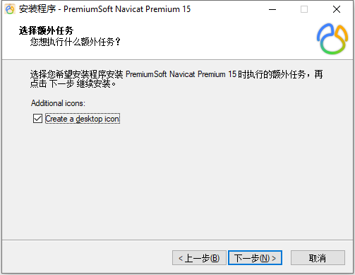 

#### 准备安装：

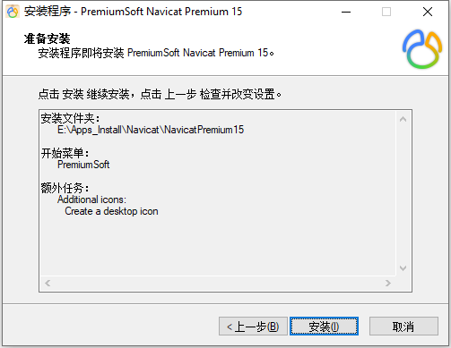 

#### 完成：

 

### 破解

管理员运行 `Keygen`，通过 `Patch` 找到安装目录的 `navicat.exe`，破解

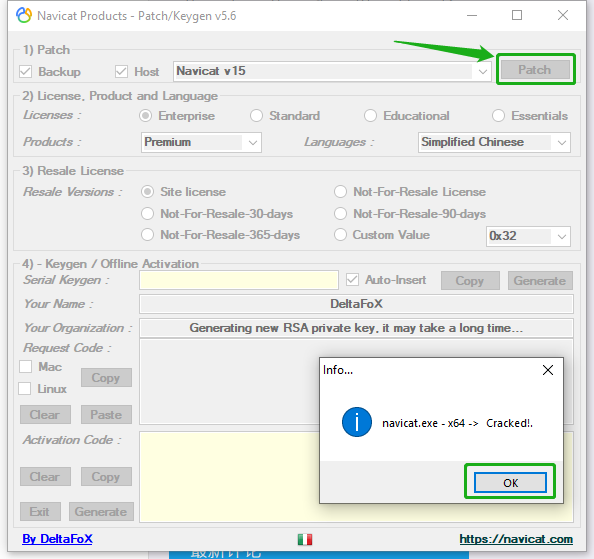 

点击 `Generate` 生成 `Serial Keygen`

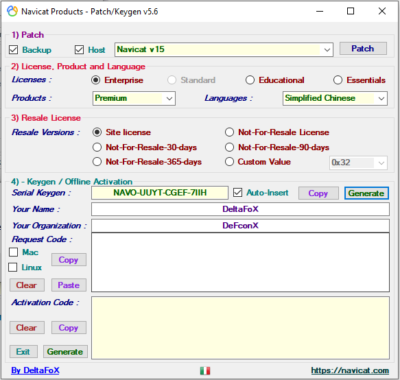 

打开 `Navicat`，注册

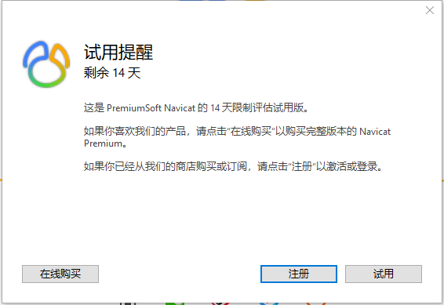 

输入刚才的 `Serial Keygen`

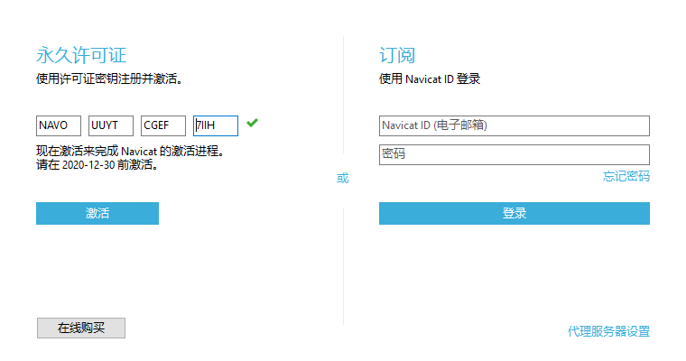 

激活弹框，手动激活

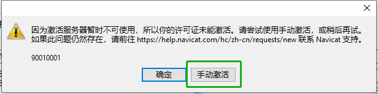 

`请求码` 复制到 `Keygen`，`Generate` 复制到 `激活码`

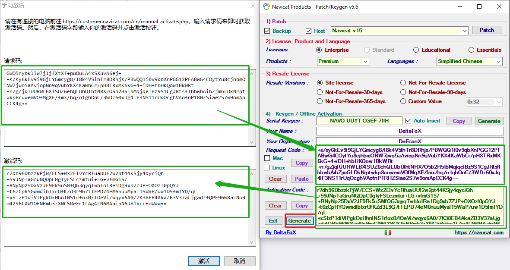 

激活完成

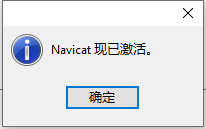 

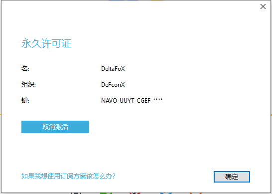 

### 检测

 

版本信息

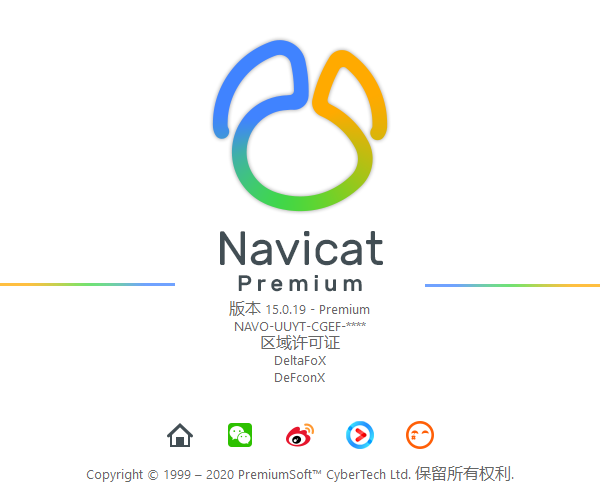

### 相关问题追查解决备注

### DONE

