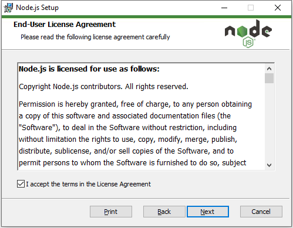
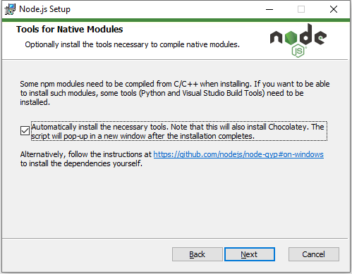
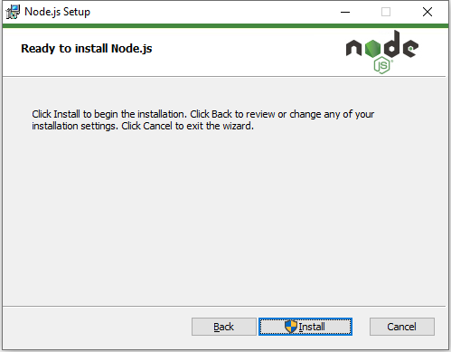

# <font color=#69D600>Node Install</font>

[TOC]

官网下载：https://nodejs.org/en/

#### Version: node-v14.15.1-x64

平台：Windows

文件：node-v14.15.1-x64.msi


### 开始安装

#### Welcome:

Next

 


#### End-User License Agreement:

 


#### Destination Folder:

选择安装路径

 


#### Custom Setup:

按需安装，一般全装

 


#### Tools for Native Modules:

本地模块工具，有些模块安装可能需要用到这些工具，勾选安装完 `Node.js` 会自动弹框 `Windows PowerShell` 安装

 


#### Ready to install Node.js:

 


#### Finish:

 


#### Tools Install:

前面勾选 Automatically Install 会自动弹框，需要按任意键继续，不想装可以直接关终端

 


### 检测
``` shell
node -v
v14.15.1
```


### 相关问题追查解决备注


### DONE


