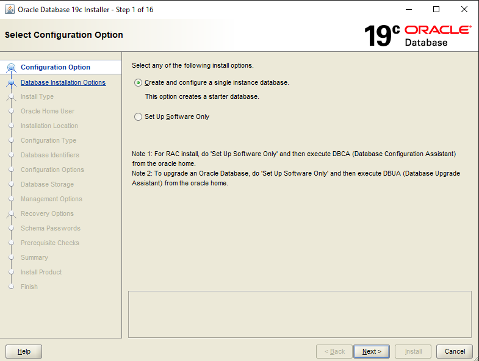
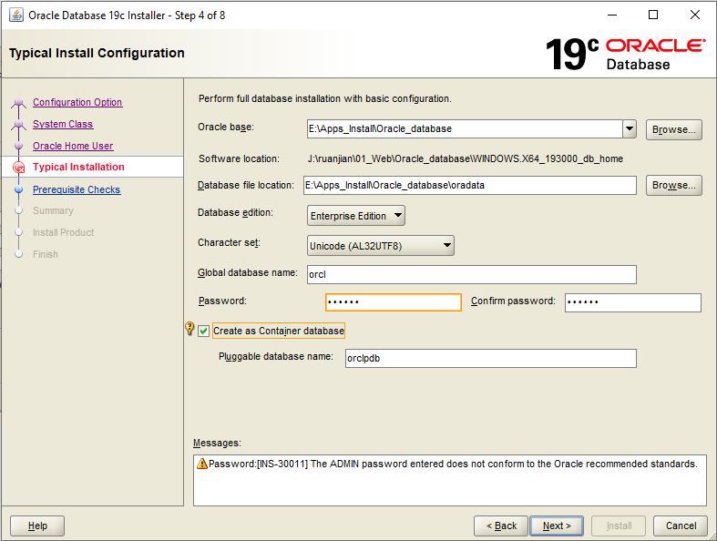
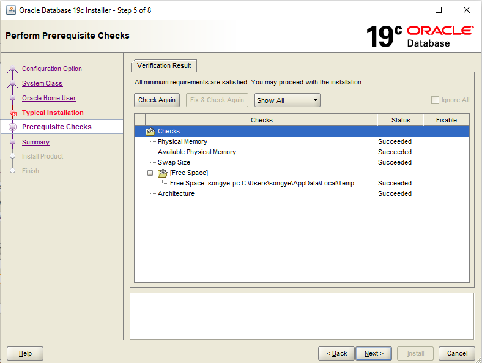
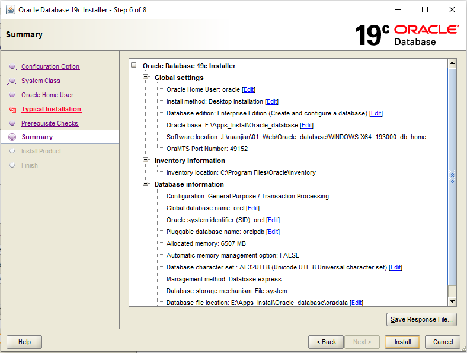
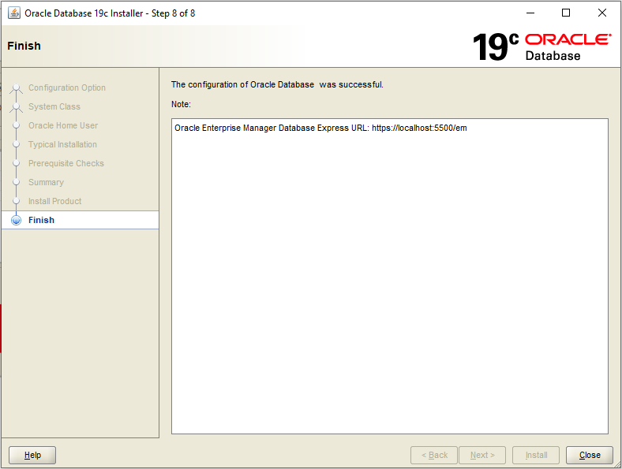
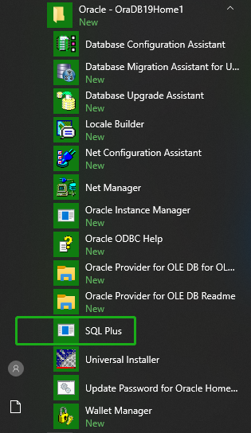

# Oracle Database Install

[TOC]

Oracle官网下载：https://www.oracle.com/database/technologies/oracle-database-software-downloads.html

#### Version: WINDOWS.X64_193000_db_home

平台：Windows

文件：WINDOWS.X64_193000_db_home/setup.exe

### 开始安装

#### Configuration Options:

默认选项，安装新数据库，Next

 

#### Select System Class:

个人使用桌面类，Next

 

#### Specify Oracle Home User:

创建新用户，Next

 

#### Typical Install Configuration:

典型安装，配置安装路径，企业版，Unicode编码，默认账密，Next，密码不符合建议不用管，直接 Continue

 

#### Perform Prerequisite Checks:

先决条件会自动检查，通过会自动 Next

 

#### Summary:

概要没问题开始 Install

 

#### Install Product:

安装过程添加用户进组失败不用管，Continue 

 

Close

 

### 检测
https://localhost:5500/em/login 登录弹窗，不需要填容器名

数据库状态

 

**SQL Plus:**

 

 

### 相关问题追查解决备注

### DONE

