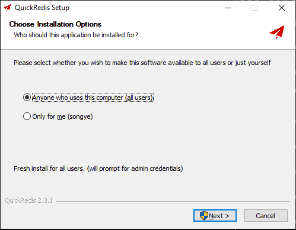
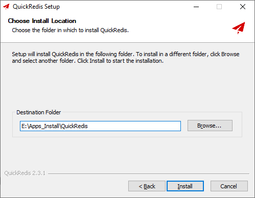
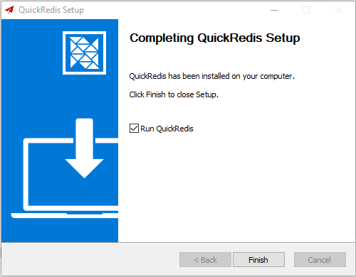
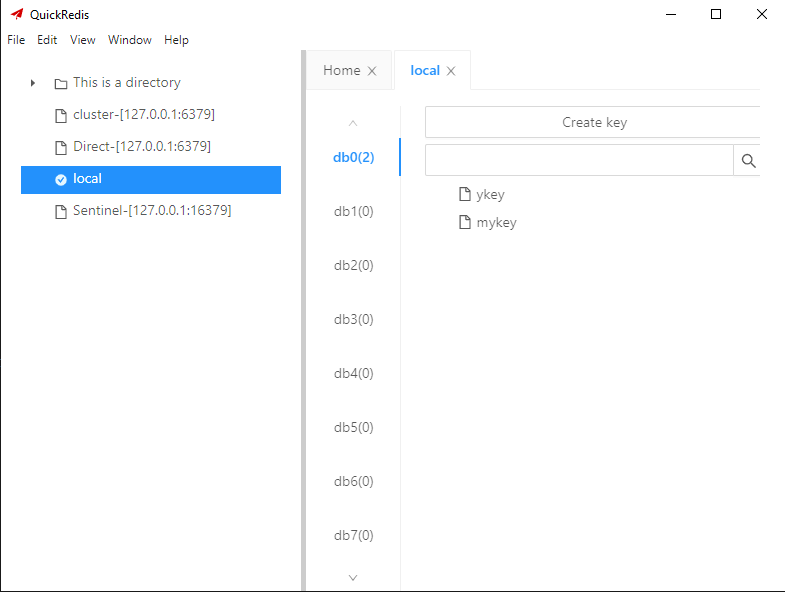

# QuickRedis Install

[TOC]

官网：https://quick123.net/

官网下载：https://github.com/quick123official/quick_redis_blog/releases/download/v2.2.0/QuickRedis-2.2.0-win.exe

#### Version: QuickRedis-2.3.1

平台：Windows

文件：QuickRedis-2.3.1-win.exe

### 开始安装

#### Choose Installation Options:

  

#### Choose Install Location:

 

#### Completing QuickRedis Setup:

 

Finish

### 检测

 

### 相关问题追查解决备注

### DONE

