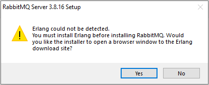
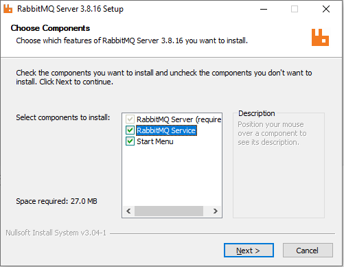
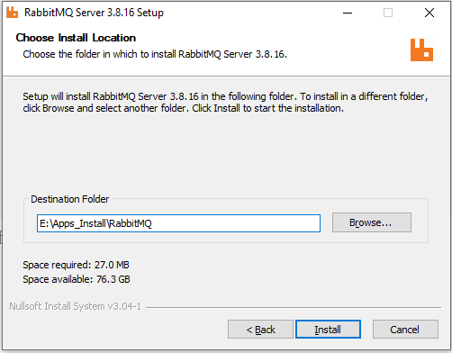
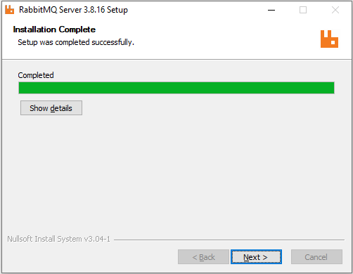
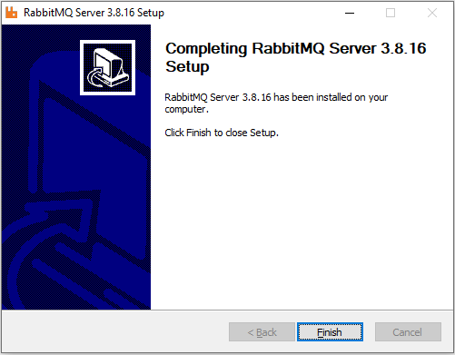
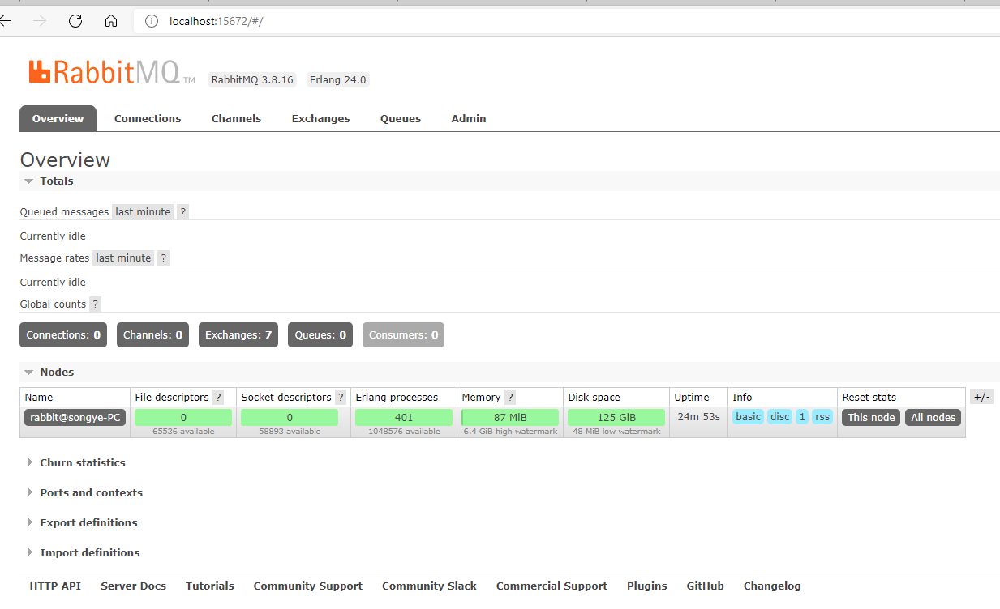

# Redis Desktop Manager Install

[TOC]

官网：https://www.rabbitmq.com/

官网下载：https://github.com/rabbitmq/rabbitmq-server/releases/download/v3.8.16/rabbitmq-server-3.8.16.exe

#### Version: rabbitmq-server-3.8.16

平台：Windows

文件：rabbitmq-server-3.8.16.exe

> 依赖 Erlang， 需先安装 [Erlang](./Erlang Install.md)

### 开始安装

#### Erlang:

  

#### Choose Components:

 

#### Choose Install Location:

安装目录

 

#### Installation Complete:

Completed

 

#### Completing RabbitMQ Server 3.8.16 Setup:

 

Finish

### 检测

 

### 相关问题追查解决备注

### DONE

