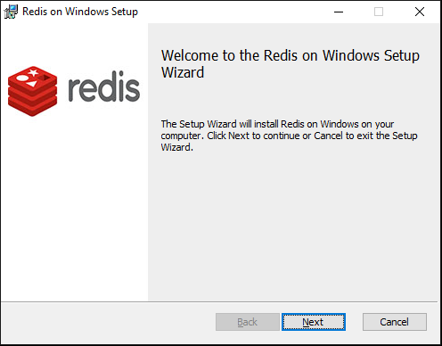
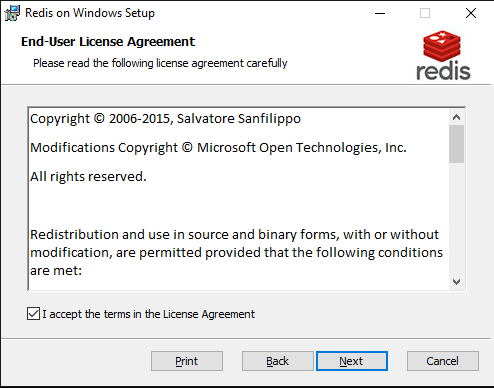
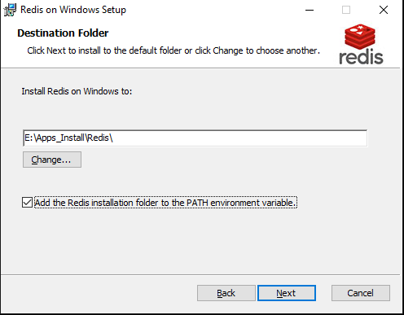
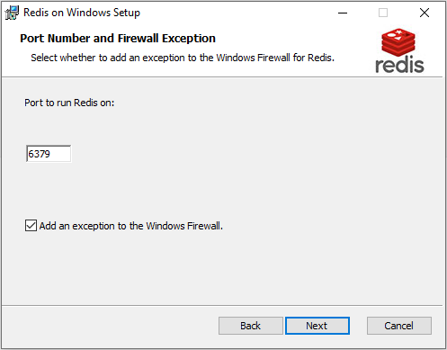
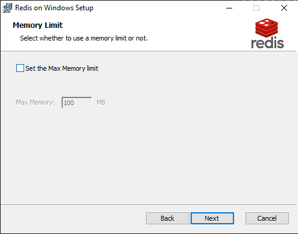
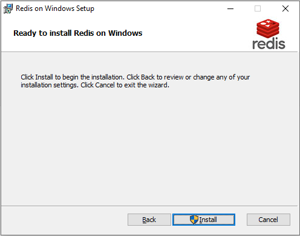
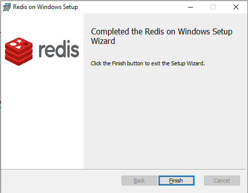

# <font color=#69D600>Redis Install</font>

[TOC]

官网：https://redis.io/

Windows 版下载：https://github.com/microsoftarchive/redis/releases

#### Version: Redis-x64-3.2.100

平台：Windows

文件：Redis-x64-3.2.100.msi

​			Redis-x64-3.2.100.zip	// 免安装版解压后 cmd 运行命令 redis-server.exe redis.windows.conf

> 因 Windows 版 Redis 已于 2016 停止版本更新，与官网版本落后太多，这里安装仅作为临时需要使用，正常开发和生成在 Linux 安装使用


### 开始安装

#### Welcome:

  


#### End-User  License Agreement:

accept

 


#### Destination Folder:

安装目录，可以勾上添加环境变量

 


#### Port Number and Firewall Exception:

默认

 


#### Memory Limit:

最大内存，先不处理

 


#### Ready to install Redis on Windows:

 


#### Completed:

 

Finish


### 检测

```
redis-cli -h 127.0.0.1 -p 6379
127.0.0.1:6379> set mykey abc
OK
127.0.0.1:6379> get mykey
"abc"
127.0.0.1:6379>
```


### 相关问题追查解决备注


### DONE


