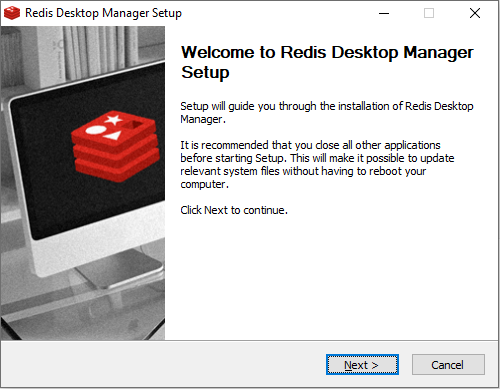
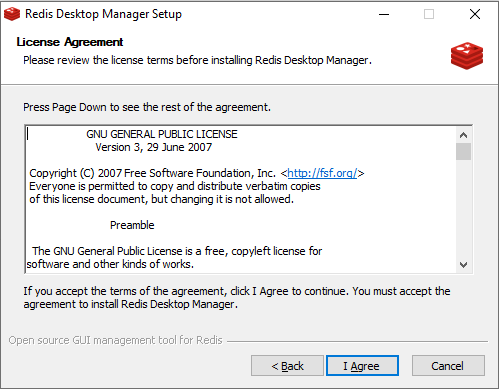
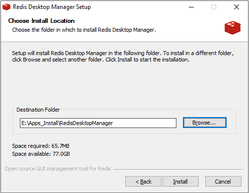
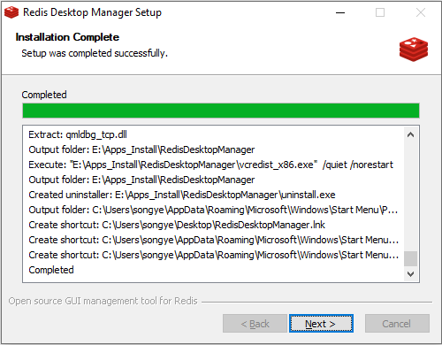
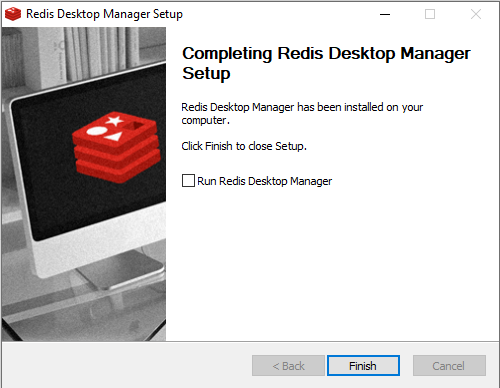
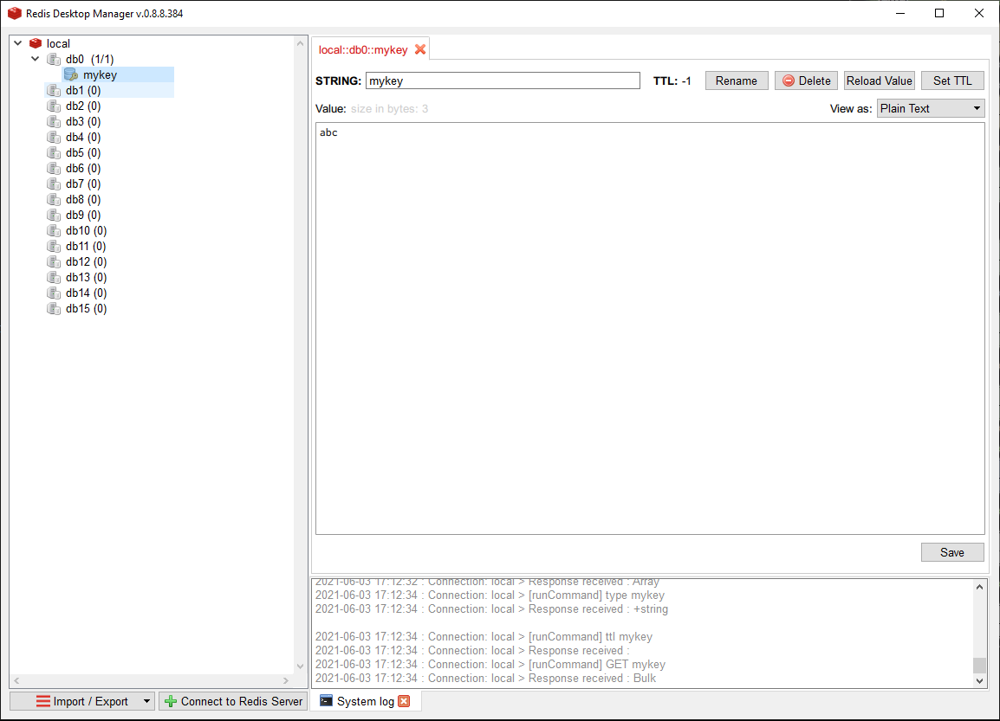

# Redis Desktop Manager Install

[TOC]

官网：https://rdm.dev/

官网下载：https://github.com/uglide/RedisDesktopManager/releases/download/0.8.8

#### Version: redis-desktop-manager-0.8.8.384

平台：Windows

文件：redis-desktop-manager-0.8.8.384.exe

> 新版收费

### 开始安装

#### Welcome:

  

#### License Agreement:

I Agree

 

#### Choose Install Location:

安装目录，可以勾上添加环境变量

 

#### Installation Complete:

Completed

 

#### Completing Redis Desktop Manager Setup:

 

Finish

### 检测

 

### 相关问题追查解决备注

### DONE

