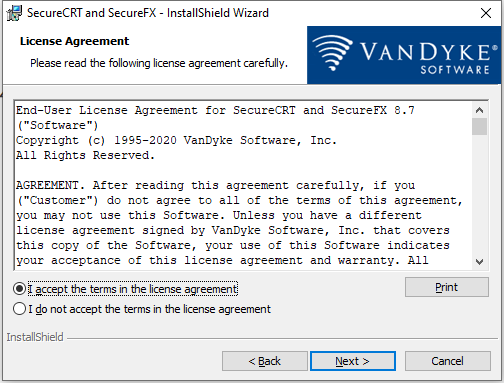
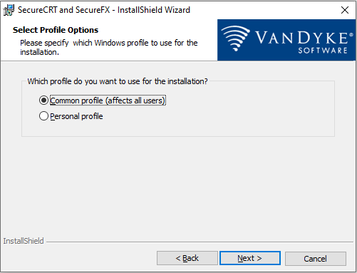
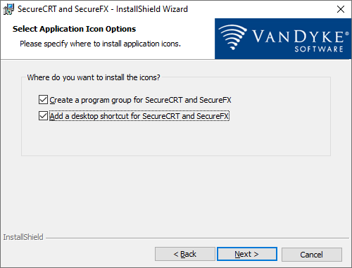
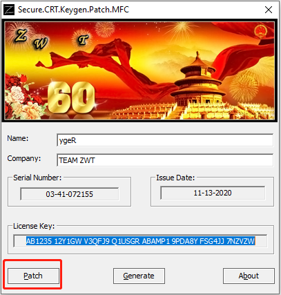
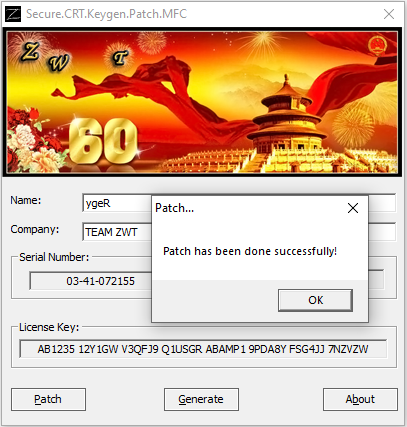
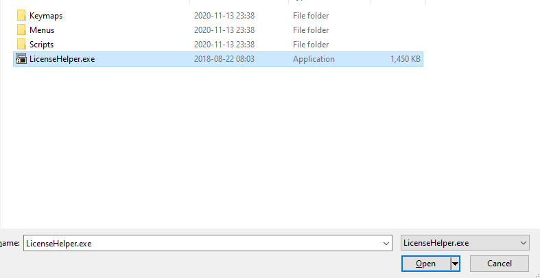
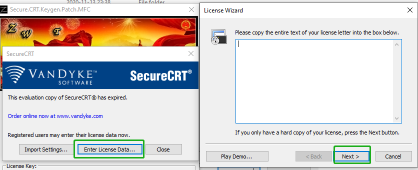
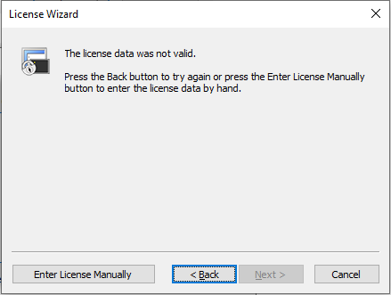
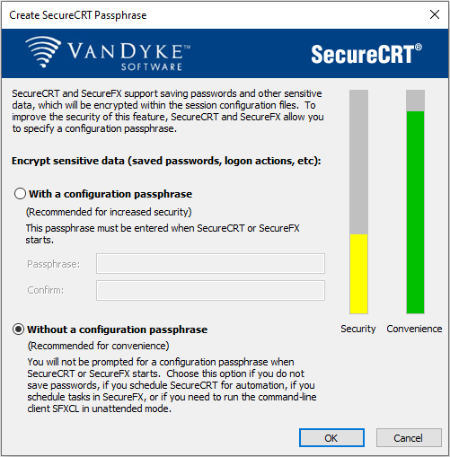
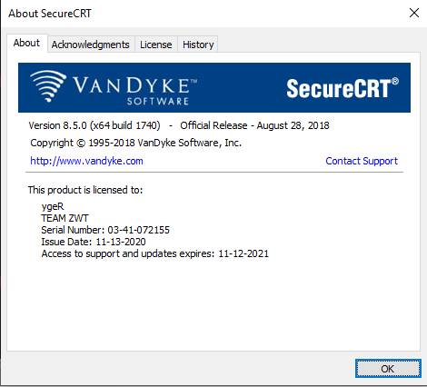

# SecureCRT Install

[TOC]

官网下载：暂无

#### Version: scrt_sfx8.5.0

平台：Windows

文件：scrt_sfx8.5-x64.exe Keygen.exe

### 开始安装

先安装，再破解

#### License Agreement:

Next

 

#### Select Profile Options:

Next

 

#### Setup Type:

Next

 

#### Custom Setup:

SecureFX 破解器版本不对，可以不安装FX，Next

 

#### Select Application Icon Options:

Next

 

#### Ready to Install the Program:

Next

 

#### InstallShield Wizard Completed:

Finish

 

### 破解

复制文件 Keygen.exe 到安装目录，管理员运行，确认都有数据后，Patch 选 SecureCRT.exe 打补丁

 

 

OK，继续选择 LicenseHelper.exe 打补丁

 

OK 后打开 SecureCRT，Enter License Data...，License Wizard 直接 Next

 

Enter License Manually

 

填写对应信息

 

填写对应信息

 

填写对应信息

 

破解成功

 

运行软件设置密码，暂不需要

 

### 检测

有效期一年

 

### 相关问题追查解决备注
暂无

### DONE

