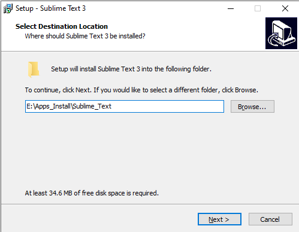
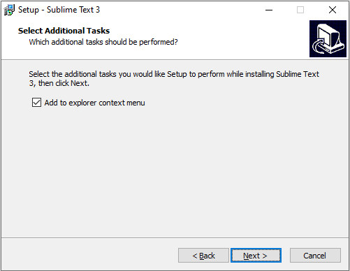
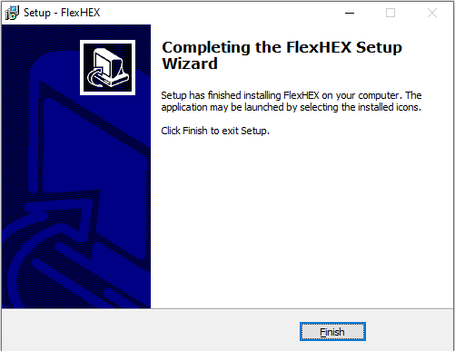
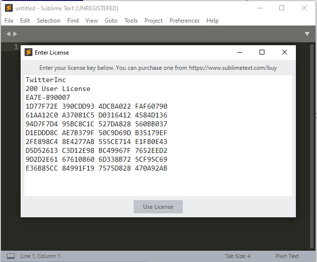

# <font color=#69D600>Sublime Text Install</font>

[TOC]

官网下载：https://www.sublimetext.com/3

   				http://www.flexhex.com/download/flexhex_setup.exe

#### Version: Sublime Text Build 3211 x64

平台：Windows

文件：Sublime Text Build 3211 x64 Setup.exe    flexhex_setup.exe


### 开始安装

先安装，再破解

#### Select Destination Location:

选择安装路径，Next

 


#### Select Additional Tasks:

添加右键菜单，Next

 


#### Ready to Install:

确认信息，Install , Finish

 

 


### 安装 FlexHEX

#### License Agreement:

accept, Next

 


#### Select Destination Location:

Next

 


#### Select Start Menu Folder:

Next

 

Install, Finish

 

 


### 破解

复制 host 文件到桌面，追加以下内容

```
# sublimetext
127.0.0.1 www.sublimetext.com
127.0.0.1 sublimetext.com
127.0.0.1 sublimehq.com
127.0.0.1 telemetry.sublimehq.com
127.0.0.1 license.sublimehq.com
127.0.0.1 45.55.255.55
127.0.0.1 45.55.41.223
```

用 FlexHEX 打开 Sublime Text 安装目录 sublime_text.exe 文件，搜索 97 94 0D，只有一处，ctrl + R 替换为 00 00 00，保存

打开 Sublime Text，**Help --> Enter Lisence** 添加以下内容

```
----- BEGIN LICENSE -----
TwitterInc
200 User License
EA7E-890007
1D77F72E 390CDD93 4DCBA022 FAF60790
61AA12C0 A37081C5 D0316412 4584D136
94D7F7D4 95BC8C1C 527DA828 560BB037
D1EDDD8C AE7B379F 50C9D69D B35179EF
2FE898C4 8E4277A8 555CE714 E1FB0E43
D5D52613 C3D12E98 BC49967F 7652EED2
9D2D2E61 67610860 6D338B72 5CF95C69
E36B85CC 84991F19 7575D828 470A92AB
------ END LICENSE ------
```

 

Use License. Thanks for purchasing! 完成破解

 


### 检测
**Help --> About Sublime Text**

 


### 相关问题追查解决备注
暂无


### DONE


