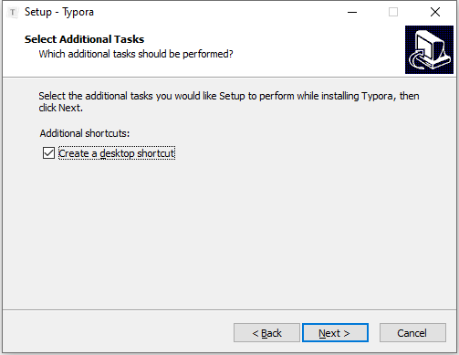
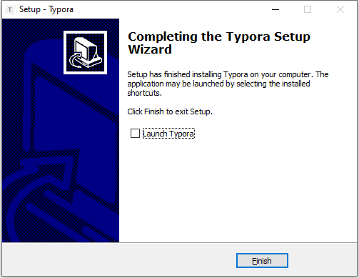

# Typora Install

[TOC]

官网下载：https://typora.io/windows/typora-setup-x64.exe

#### Version: typora-setup-x64
平台：Windows

文件：typora-setup-x64.exe

### 开始安装

#### Select Destination Location:

  

#### Select Additional Tasks:

 

#### Ready to Install:

 

Finish

 

### 检测

 

### 相关问题追查解决备注

### DONE

