# <font color=#69D600>Ubuntu Install</font>

[TOC]

官网路径：https://ubuntu.com/download/desktop

​				   https://mirrors.neusoft.edu.cn/ubuntu-releases/20.04.2.0/ubuntu-20.04.2.0-desktop-amd64.iso

华为镜像：https://repo.huaweicloud.com/ubuntu-releases/20.04.2.0/

​				   https://mirrors.huaweicloud.com/home

#### Version: Ubuntu 20.04.2.0 LTS

平台：VMware Workstation 16 Pro

文件：ubuntu-20.04.2.0-desktop-amd64.iso

> note: 从 mirror 链接下载 iso 文件，其实就是阿里云网易搜狐之类的镜像库，可以直接到镜像库找，大部分开源软件都可以在镜像库下载


### 开始安装

> Note:
>
> 安装到虚拟机则先创建新虚拟机，通过虚拟机加载镜像安装系统
>
> 安装到硬盘则可以先从本地磁盘分配好空间备用，镜像可以用 U 盘制作启动盘，或刻录到光盘

创建新虚拟机 详见 [VM Virtual Machine.md](./VM Virtual Machine.md)


### 安装系统

#### Install Ubuntu LTS Linux:

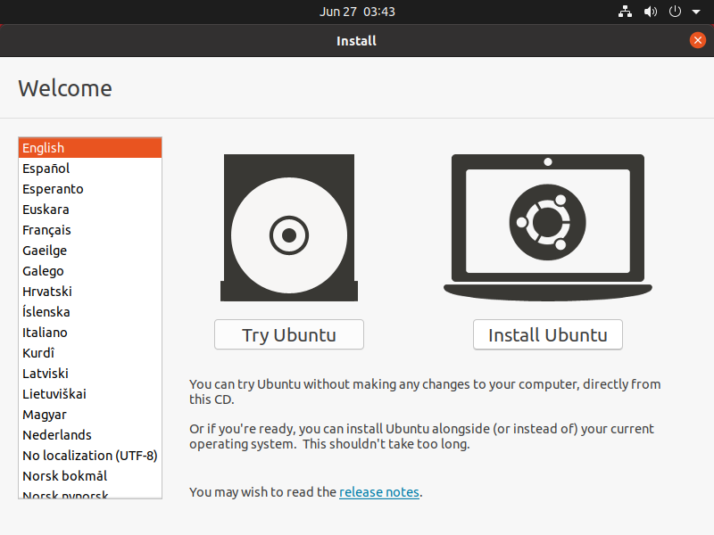 

选择 Install Ubuntu，选择键盘和语言，Continue

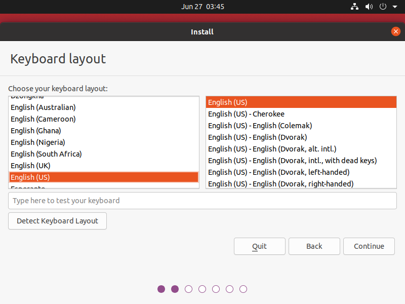 


#### Updates and other software:

比 CentOS 选项少，不能自己选择需要的软件

最小化安装，默认图形界面

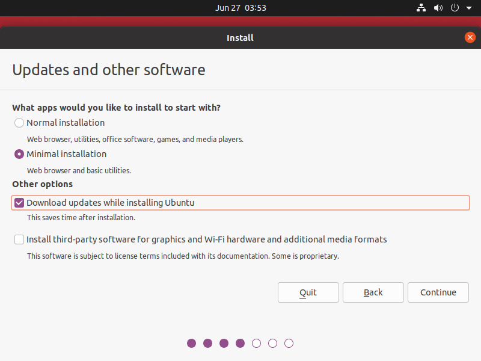 


#### Installation type:

其他，自定义分区

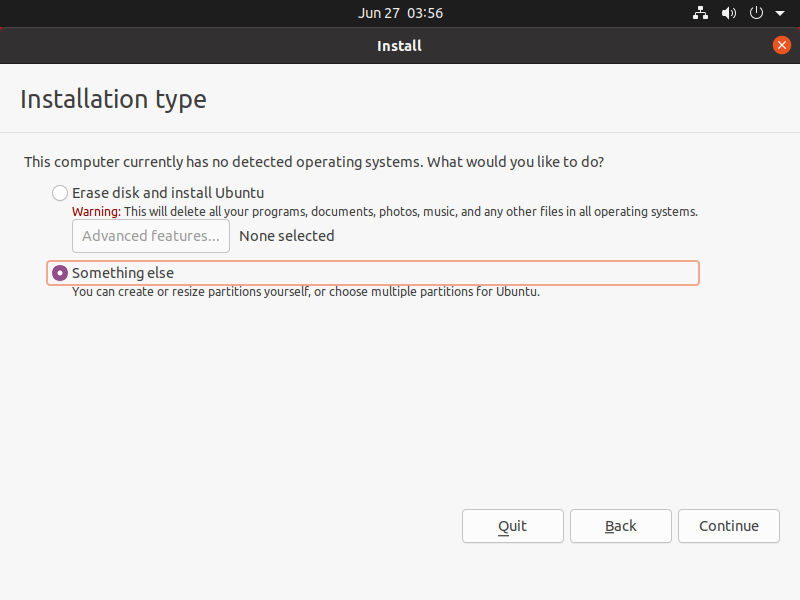 

新建分区

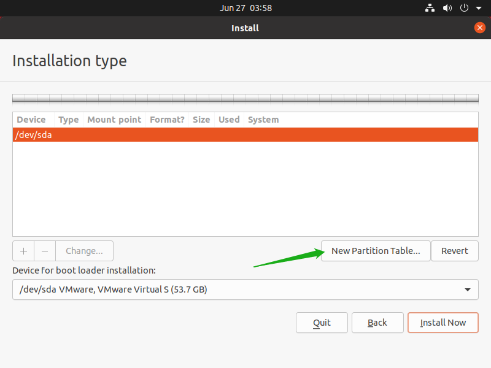 

提示重新分区会删除之前的分区，同时也会删除内容，这里是空盘还没分过区，Continue

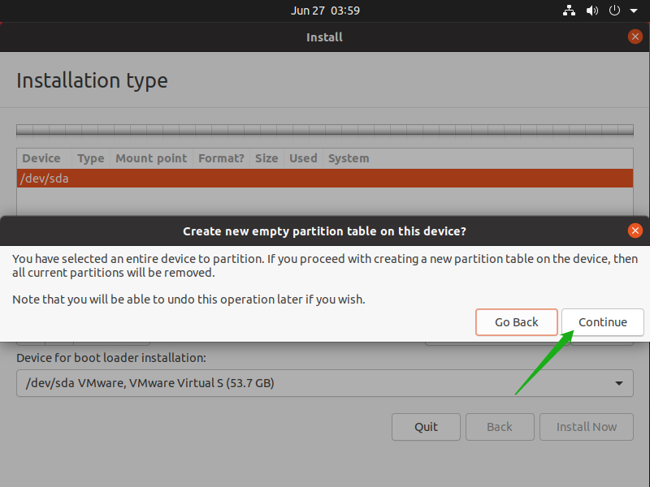 

双击 free space 或单击创建分区

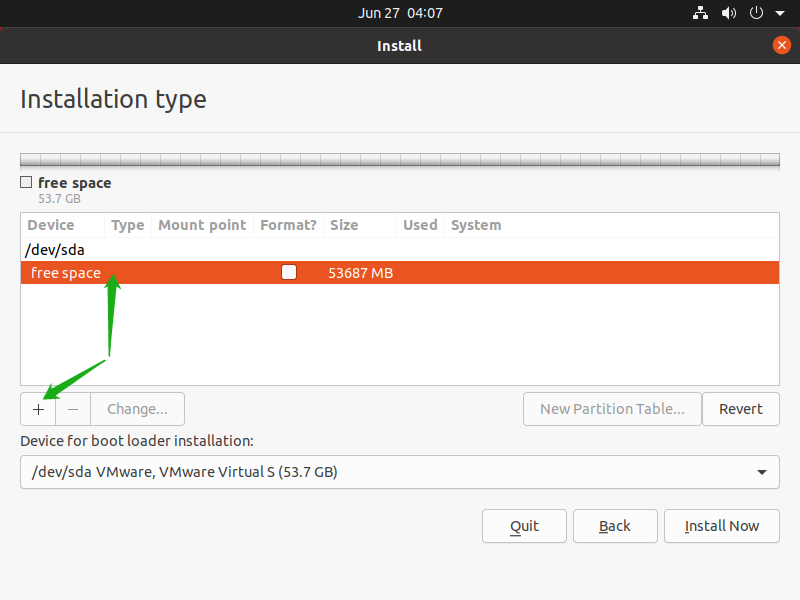 

添加启动盘挂载点，需要分好分区大小，创建好可以修改文件类型不能修改大小

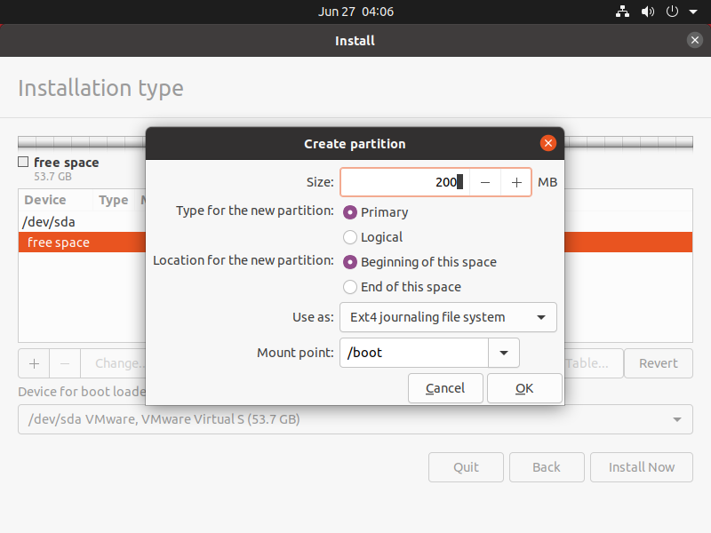 

和 CentOS 稍有不同，swap 分区需要从下拉列表选择

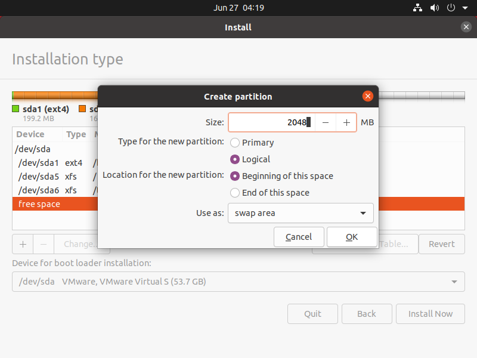 

分区配置，把分区加上，容量也要先设置好

 

Continue

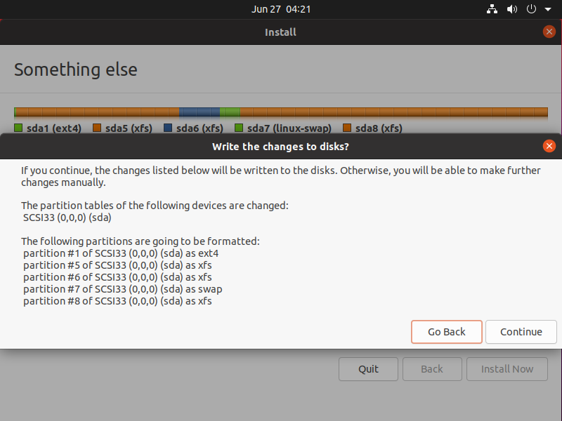 

从配置上看主要有 DATA 和 SYSTEM 两个区域，先按以下方案进行了配置

```
分区		大小		文件系统
/boot	200M	ext4
/		16G		xfs
/tmp	4G		xfs
swap	2G		xfs
/home	30G	xfs
```


#### Where are you?

Shanghai

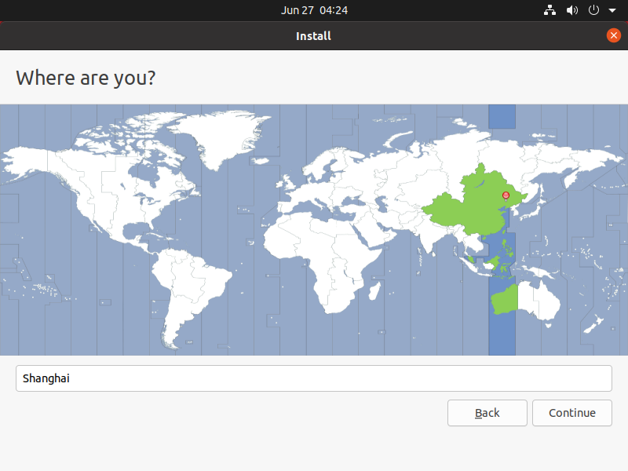 


#### Who are you?

填写用户信息

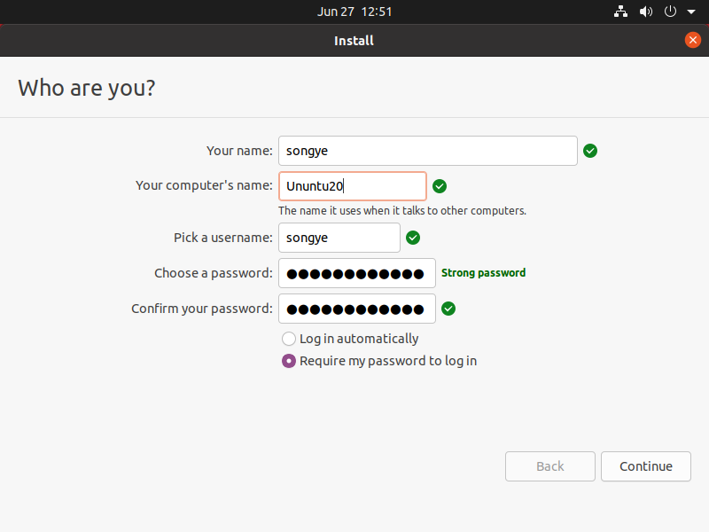 

安装过程可以点箭头查看 Ubuntu 特色

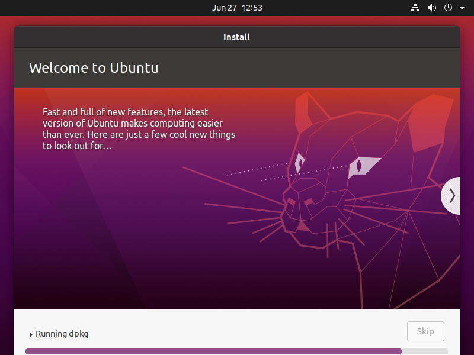 

完成安装，重启系统

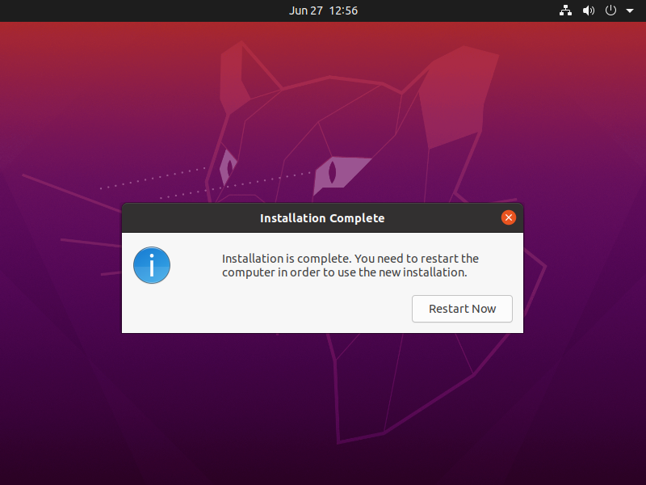 

进入系统

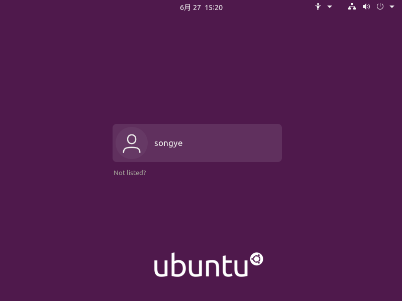 


### 检测

打开终端，df -h

```
$ df -h
Filesystem      Size  Used Avail Use% Mounted on
udev            951M     0  951M   0% /dev
tmpfs           196M  1.8M  195M   1% /run
/dev/sda5        16G  5.7G  9.7G  37% /
tmpfs           980M     0  980M   0% /dev/shm
tmpfs           5.0M  4.0K  5.0M   1% /run/lock
tmpfs           980M     0  980M   0% /sys/fs/cgroup
/dev/loop1      219M  219M     0 100% /snap/gnome-3-34-1804/66
/dev/loop0       56M   56M     0 100% /snap/core18/1988
/dev/loop2       65M   65M     0 100% /snap/gtk-common-themes/1514
/dev/loop3       52M   52M     0 100% /snap/snap-store/518
/dev/loop4       32M   32M     0 100% /snap/snapd/11036
/dev/sda1       169M  139M   17M  90% /boot
/dev/sda6       3.9G   60M  3.8G   2% /tmp
/dev/sda8        29G  247M   29G   1% /home
tmpfs           196M   20K  196M   1% /run/user/1000
tmpfs           196M   24K  196M   1% /run/user/125
```

swap 大小似乎有出入，目录也比较多，不清楚

```
/boot	169M	ext4	// /boot
/		16G		xfs		// /
/tmp	4G		xfs		// /tmp
swap	2G		xfs		// /dev /run /sys/fs/cgroup
/home	29G		xfs		// /home
```

```
bin -> usr/bin		/
boot				/
dev				
etc					/
home				/home
lib -> usr/lib		/
lib64 -> usr/lib64	/
media				/
mnt					/
opt					/
proc				/proc
root				/
run				
sbin -> usr/sbin	/
srv					/
sys				
tmp					/tmp
usr					/
var					/
```


### 相关问题追查解决备注


### DONE


