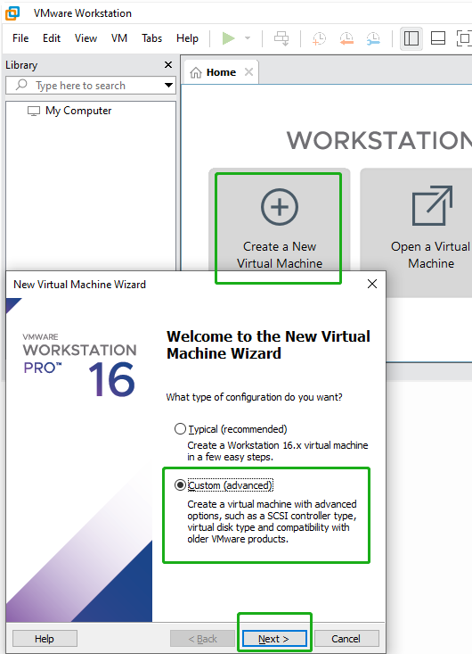
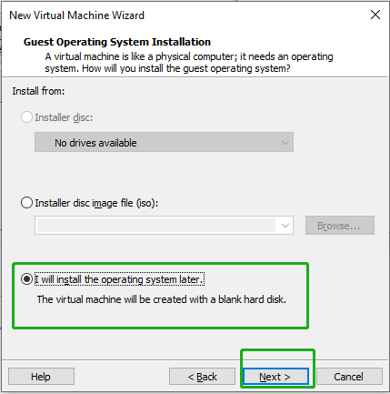
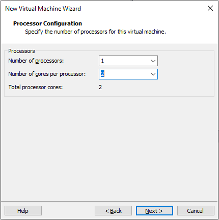
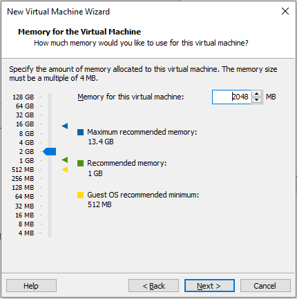
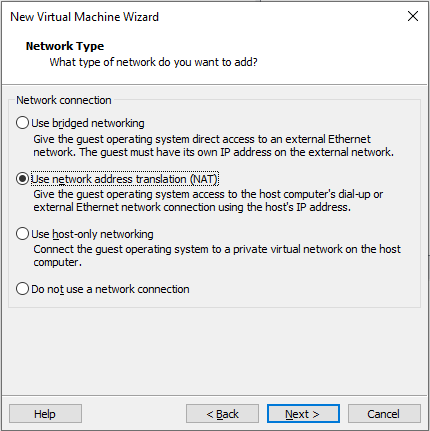
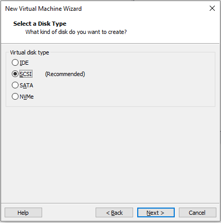
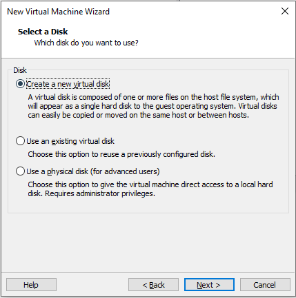
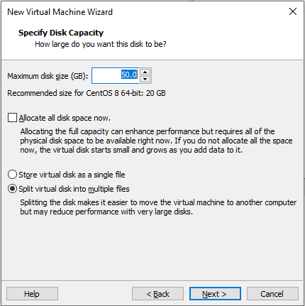
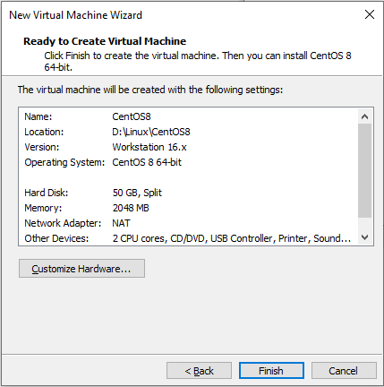

# Virtual Machine

[TOC]

#### Version: Workstation 16 Pro

平台：VMware Workstation 16 Pro

> note: 

### 开始安装

#### Create a New Virtual Machine

先在 VMware 创建新虚拟机，模拟一台新电脑，再给电脑安装系统

创建新虚拟机

自定义，不要问为什么，纯**，Next

 

#### Choose the Virtual Machine Hardware Compatibility:

硬件兼容，Workstation 16.x ，右边为对应版本支持硬件最大上限，Next

 

#### Guest Operating System Installation:

稍后再安装系统，Next

 

#### Select  a Guest Operating System:

选择操作系统

​	**Windows：**微软系列系统

​	**Linux：**主要有 Red Hat 系列、Debian 系列、SUSE、 Mandriva 和其他，有些未列出可选 Other Linux x.x kernel 对应 Linux 内核版本

​		Red Hat 系列： RHEL、CentOS、Fedora、Oracle Linux 等

​		Debian 系列： Debian、Ubuntu 等

​	**VMware ESX：**通用环境下分区和整合系统的虚拟主机软件

​	**Other：**主要有微软 MS-DOC、及非 Linux 内核的类 Unix 系统 FreeBSD、NetWare、 Solaris，其他为列出可选 Other

Next

 

#### Name the Virtual Machine:

虚拟机命名，选择安装路径，Next

 

#### Processor Configuration:

根据需要选择，1 CPU，2内核，Next

 

#### Memory for the Virtual Machine:

根据需要选择，2G 内存，Next

 

#### Network Type:

​	**Bridged：**为客户机操作系统提供直接访问外部以太网网络的权限。客户机在外部网络上必须有自己的 IP 地址。对应宿主机网络适配器，即真实网卡网络适配器

​	**NAT：**为客户机操作系统提供使用主机 IP 地址访问主机拨号连接或外部以太网网络连接的权限。对应虚拟网络适配器 VMnet8

​	**Host-only：**将客户机操作系统连接到主机上的专用虚拟网络。对应虚拟网络适配器 VMnet1

**Bridged、NAT** 正常宿主机能上网，虚拟机也能上网。**Host-only** 虚拟机可以连接宿主机，不能上网

**Bridged** 适合局域网（同路由器）不同主机和虚拟机互相连接通信，比如同宿舍局域网室友都可以连接虚拟机，或自己多台电脑上的虚拟机局域网内做集群测试

**NAT** 限制局域网其他主机和虚拟机互相连接通信，比如同宿舍局域网限制室友连接虚拟机，自己 high

Next

 

#### Select I/O Controller Types:

​	**BusLogic：**旧设备标准接口，不支持 64 位系统

​	**LSI Logic：**一般的 SCSI 标准接口

​	**LSI Logic SAS：**SAS 标准接口，更快的 I/O

​	**Paravirtualized SCSI：**半虚拟 SCSI 接口

选择不同的系统会有不同的推荐，默认，Next

 

#### Select a Disk Type:

​	**IDE：**并行接口硬盘，早期台式机主流硬盘，传输慢，有并行线路的信号干扰问题

​	**SCSI：**性能好、稳定性高、传输快、支持热插拔，价格较贵，主要用于服务器

​	**SATA：**串行接口硬盘，传输较快，支持热插拔，当前主流的机械硬盘

​	**NVMe：**传输更快的固态硬盘，NVMe 协议要比 SATA 所用的 AHCI 协议更高效、更能充分利用多核心、中断执行效率更高、队列深度支持更好

同样选择不同的系统会有不同的推荐，默认，Next

 

#### Select a Disk:

​	创建新虚拟硬盘

​	或选择现有虚拟硬盘（之前创建但还没有使用）

​	高级用户可以考虑使用物理硬盘，最好事先从本地磁盘分配好空间备用，Next

 

#### Specify Disk Capacity:

根据需要选择，容量 50G

​	分配所有磁盘空间，如果不分配虚拟磁盘开始较小，随数据增多而增大。

​	单文件形式

​	多文件形式，方便迁移，但可能影响大容量磁盘性能

Next

 

#### Specify Disk File:

指定磁盘文件路径，Next

 

#### Ready to Create Virtual Machine:

点击 完成 开始创建虚拟机

 

安装完可以看到虚拟机信息，进入配置

 

通过 CD 找到 ISO 镜像文件

 

启动虚拟机开始安装相关系统

 

### 检测

### 相关问题追查解决备注

### DONE

