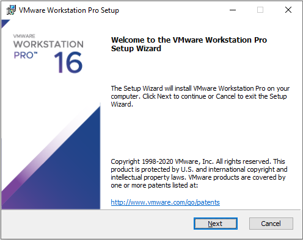
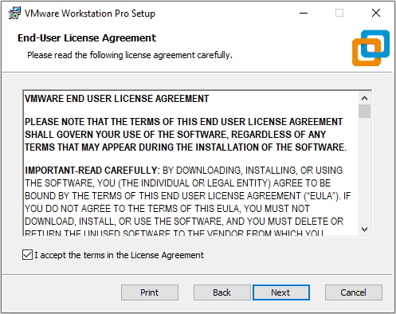
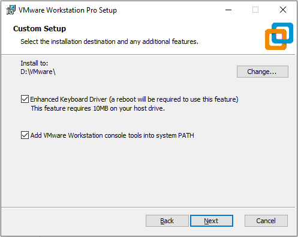
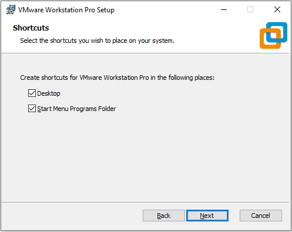
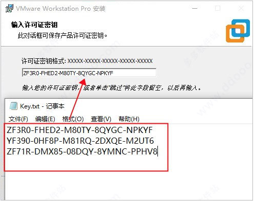
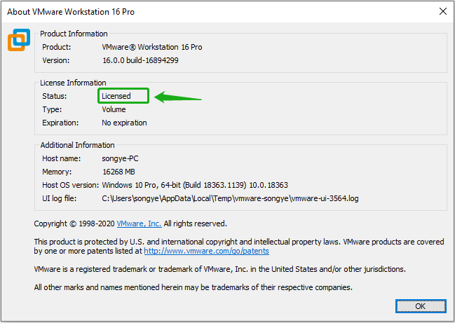

# <font color=#69D600>VMware Install</font>

[TOC]

VMware官网下载：https://www.vmware.com/products/workstation-pro/workstation-pro-evaluation.html

#### Version: VMware Workstation 16 Pro

平台：Windows

文件：VMware-workstation-full-16.0.0-16894299.exe


### 开始安装

Next

 


#### End-User License Agreement:

I accept, Next

 


#### Custom Setup:

选择安装路径，都选，Next

 


#### User Experience Settings:

检查更新去掉，用户体验去掉，Next

 


#### Shortcuts:

桌面图标开始菜单目录，Next

 

Install, Finish

 

 

安装完成重启电脑运行虚拟机，直接选输入密匙，忘记截图类似这张，输入密匙完成

```
ZF3R0-FHED2-M80TY-8QYGC-NPKYF
YF390-0HF8P-M81RQ-2DXQE-M2UT6
ZF71R-DMX85-08DQY-8YMNC-PPHV8
```

 


### 检测
 


### 相关问题追查解决备注


### DONE


