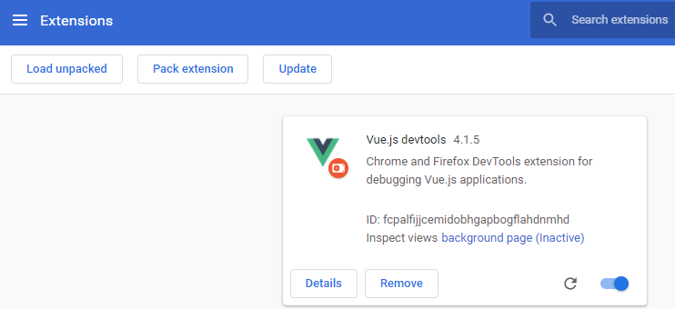

# <font color=#69D600>Vue DevTools Install</font>

[TOC]

官网下载：https://github.com/vuejs/vue-devtools

#### Version: Vue.js devtools 4.1.5

平台：Windows

文件：https://github.com/vuejs/vue-devtools

> Note: `vue-devtools ` vue的浏览器调试工具。主要是 `Chrome` 拓展插件 `Google` 的东西国内不翻墙没法安装，需要通过这种方式安装。`Firefox` 可以通过拓展插件安装
>
> git clone 后默认进入的是 dev 环境，执行 npm run build 会报错，需要切换到 master 分支


### 开始安装

#### vue-devtools for Chrome，git clone 后需要切换到 master 分支

```perl
# Git Bash Here 打开 Git，从 github 下载 vue-devtools
git clone https://github.com/vuejs/vue-devtools.git

# 不用退出 Git，直接切换目录
# git clone 后默认进入的是 dev 环境，执行 npm run build 会报错，需要切换到 master 分支
# 之前不知道有怎么一个坑，安装一直报错
cd vue-devtools

# 查看当前所在分支，确认是 dev，Git Bash 显示也是 dev
$ git branch
* dev

# 切换到 master 主分支
git checkout master

# 确认当前所在分支 master
$ git branch
  dev
* master

# 安装依赖包
npm install

# 编译打包
npm run build
```

 

 


#### Chrome 拓展插件

直接进拓展插件配置页

chrome://extensions/

`npm run build` 编译打包成功后会在 shells 下生成 chrome 扩展程序文件夹，`Load unpacked` 选择该文件夹

 

 


#### 引用参考

之前找到的都是

```
npm cache clean --force
rm -rf node_modules
rm -rf package-lock.json
npm install

npm run build
```

无限循环都报错，最后终于找到的有用参考：

[vue调试工具vue-devtools安装及使用（亲测有效，望采纳）](https://www.cnblogs.com/chenhuichao/p/11039427.html)


#### vue-devtools for Firefox

直接进入

about:addons

搜索 vue.js

从搜索结果 Search results `Vue.js devtools` 点进去安装

回到 about:addons

 


### 检测

#### Chrome

 

#### Firefox

 


### 相关问题追查解决备注
安装过程遇到很多报错，`Node.js` 删除重装，`vue-devtools` 删除重下，npm 安装卸载 vue、vue-cli、cross-env、webpack、webpack-cli、cnpm、semver，npm 清缓存、清 node_modules、清 package-lock.json、重装重 build，删除参数webpack --hide-modules，都无效

**‘vue-cli-service’ is not recognized as an internal or external command**

**‘cross-env’ is not recognized as an internal or external command**

**‘webpack’ is not recognized as an internal or external command**

**unmet peer dependency vue@3.0.3**

**npm ERR! missing script：build**

**Cannot find module 'semver'**

**[webpack-cli] Unknown argument: --hide-modules**

...其他报错不记得了


#### npm 一些全局工具安装记录及部分命令

```
### 临时记录，后期另外整个 Command.md
# npm install -g
npm install -g @vue/cli
npm install -g cnpm
npm install -g webpack
npm install -g webpack-cli

# npm install --save-dev
npm install --save-dev cross-env

# vue version
vue -V
vue --version

# npm uninstall -g
npm uninstall -g @vue/cli

# build:prod 执行配置文件 build:prod，而不是 build 或 build:other
npm run build:prod

# 全局工具包列表，depth=0 不显示依赖，depth=1 显示一级依赖，以此类推
npm ls -g --depth=0 


# 默认 registry
npm config set registry https://registry.npmjs.org/
# 自定义配置，优先 taobao，因为其他不了解
npm config set registry https://registry.npm.taobao.org 
npm config set registry http://r.cnpmjs.org
npm config set registry http://registry.npmjs.eu

# config 列表，两种不同显示结果
npm config ls -l
npm config list
```


#### 具体成功安装全过程

```
songye@songye-PC MINGW64 /e/Apps_Install/Vue_evtools_chrome
$ git clone https://github.com/vuejs/vue-devtools.git
Cloning into 'vue-devtools'...
remote: Enumerating objects: 140, done.
remote: Counting objects: 100% (140/140), done.
remote: Compressing objects: 100% (87/87), done.
remote: Total 10147 (delta 59), reused 89 (delta 51), pack-reused 10007
Receiving objects: 100% (10147/10147), 8.94 MiB | 11.00 KiB/s, done.
Resolving deltas: 100% (6642/6642), done.

songye@songye-PC MINGW64 /e/Apps_Install/Vue_evtools_chrome
$ git branch
fatal: not a git repository (or any of the parent directories): .git

songye@songye-PC MINGW64 /e/Apps_Install/Vue_evtools_chrome
$ cd vue-devtools

songye@songye-PC MINGW64 /e/Apps_Install/Vue_evtools_chrome/vue-devtools (dev)
$ git branch
* dev

songye@songye-PC MINGW64 /e/Apps_Install/Vue_evtools_chrome/vue-devtools (dev)
$ git checkout master
Switched to a new branch 'master'
Branch 'master' set up to track remote branch 'master' from 'origin'.

songye@songye-PC MINGW64 /e/Apps_Install/Vue_evtools_chrome/vue-devtools (master)
$ git branch
  dev
* master

songye@songye-PC MINGW64 /e/Apps_Install/Vue_evtools_chrome/vue-devtools (master)
$ npm install
npm WARN deprecated request@2.88.0: request has been deprecated, see https://github.com/request/request/issues/3142
npm WARN deprecated os-homedir@2.0.0: This is not needed anymore. Use `require('os').homedir()` instead.
npm WARN deprecated chokidar@2.1.8: Chokidar 2 will break on node v14+. Upgrade to chokidar 3 with 15x less dependencies.
npm WARN deprecated mkdirp@0.5.1: Legacy versions of mkdirp are no longer supported. Please update to mkdirp 1.x. (Note that the API surface has changed to use Promises in 1.x.)
npm WARN deprecated har-validator@5.1.5: this library is no longer supported
npm WARN deprecated fsevents@1.2.13: fsevents 1 will break on node v14+ and could be using insecure binaries. Upgrade to fsevents 2.
npm WARN deprecated popper.js@1.16.1: You can find the new Popper v2 at @popperjs/core, this package is dedicated to the legacy v1
npm WARN deprecated browserslist@1.7.7: Browserslist 2 could fail on reading Browserslist >3.0 config used in other tools.
npm WARN deprecated urix@0.1.0: Please see https://github.com/lydell/urix#deprecated
npm WARN deprecated resolve-url@0.2.1: https://github.com/lydell/resolve-url#deprecated

> uglifyjs-webpack-plugin@0.4.6 postinstall E:\Apps_Install\Vue_evtools_chrome\vue-devtools\node_modules\webpack\node_modules\uglifyjs-webpack-plugin
> node lib/post_install.js


> cypress@3.8.3 postinstall E:\Apps_Install\Vue_evtools_chrome\vue-devtools\node_modules\cypress
> node index.js --exec install


Cypress 3.8.3 is installed in C:\Users\songye\AppData\Local\Cypress\Cache\3.8.3

npm notice created a lockfile as package-lock.json. You should commit this file.
npm WARN eslint-plugin-vue@7.0.0-beta.4 requires a peer of eslint@^6.2.0 || ^7.0.0 but none is installed. You must install peer dependencies yourself.
npm WARN optional SKIPPING OPTIONAL DEPENDENCY: fsevents@1.2.13 (node_modules\webpack-dev-server\node_modules\fsevents):
npm WARN notsup SKIPPING OPTIONAL DEPENDENCY: Unsupported platform for fsevents@1.2.13: wanted {"os":"darwin","arch":"any"} (current: {"os":"win32","arch":"x64"})
npm WARN optional SKIPPING OPTIONAL DEPENDENCY: fsevents@1.2.13 (node_modules\watchpack-chokidar2\node_modules\fsevents):
npm WARN notsup SKIPPING OPTIONAL DEPENDENCY: Unsupported platform for fsevents@1.2.13: wanted {"os":"darwin","arch":"any"} (current: {"os":"win32","arch":"x64"})
npm WARN optional SKIPPING OPTIONAL DEPENDENCY: fsevents@2.1.3 (node_modules\fsevents):
npm WARN notsup SKIPPING OPTIONAL DEPENDENCY: Unsupported platform for fsevents@2.1.3: wanted {"os":"darwin","arch":"any"} (current: {"os":"win32","arch":"x64"})

added 1129 packages from 725 contributors in 370.988s

38 packages are looking for funding
  run `npm fund` for details


songye@songye-PC MINGW64 /e/Apps_Install/Vue_evtools_chrome/vue-devtools (master)
$ npm run build

> vue-devtools@4.1.5 build E:\Apps_Install\Vue_evtools_chrome\vue-devtools
> cd shells/chrome && cross-env NODE_ENV=production webpack --progress --hide-modules

 95% emitting DONE  Compiled successfully in 22295ms3:05:17 PM

Hash: 6fa421405c822898a00e
Version: webpack 3.12.0
Time: 22295ms
                 Asset       Size  Chunks                    Chunk Names
           devtools.js     878 kB       0  [emitted]  [big]  devtools
            backend.js    34.7 kB       1  [emitted]         backend
               hook.js    2.34 kB       2  [emitted]         hook
           detector.js    3.61 kB       3  [emitted]         detector
              proxy.js  878 bytes       4  [emitted]         proxy
devtools-background.js    1.78 kB       5  [emitted]         devtools-background
         background.js    2.21 kB       6  [emitted]         background

songye@songye-PC MINGW64 /e/Apps_Install/Vue_evtools_chrome/vue-devtools (master)
```


### DONE


