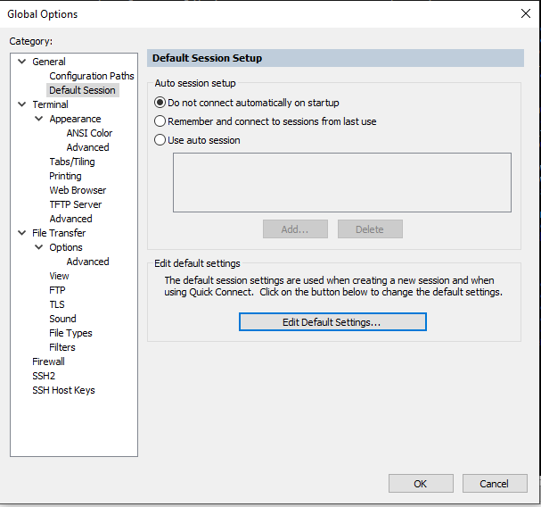
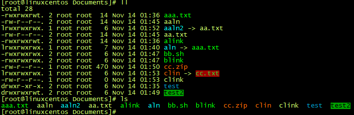

# <font color=#69D600>SecureCRT Configuration</font>

[TOC]

**# Sessions 配置文件位置**

C:\Users\songye\AppData\Roaming\VanDyke\Config\Sessions

**# 全局选项配置 Global Options:**

General -> Default Session -> Edit Default Settings...

 

编辑默认设置，图片仅供参考

 

Terminal -> Emulation

Emulation -> Terminal: Linux  select ANSI Color	// 勾选 ANSI Color

Size -> Logical rows: 36		// 终端高度，根据显示器和使用习惯设置

Size -> Logical columns: 160	// 终端宽度，根据显示器和使用习惯设置

Scrollback -> Scrollback buffer: 50000	// 回滚缓冲区，最大128000，50000差不多了

\# 配色 ANSI Color

 

Terminal -> Appearance -> ANSI Color

```
 1: 204 255 102		备用 191 255 128
12: 51 204 51		备用 64 255 0
42: 0 153 204		备用 255 155 106
72: 255 102 0
62: 0 255 0
红色备用 255 0 51
土黄备用 255 204 0
```

 


### DONE


