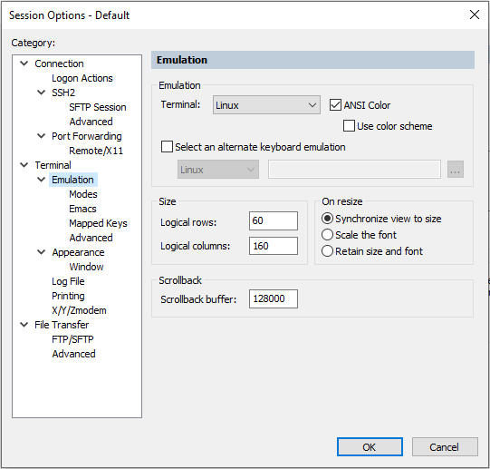
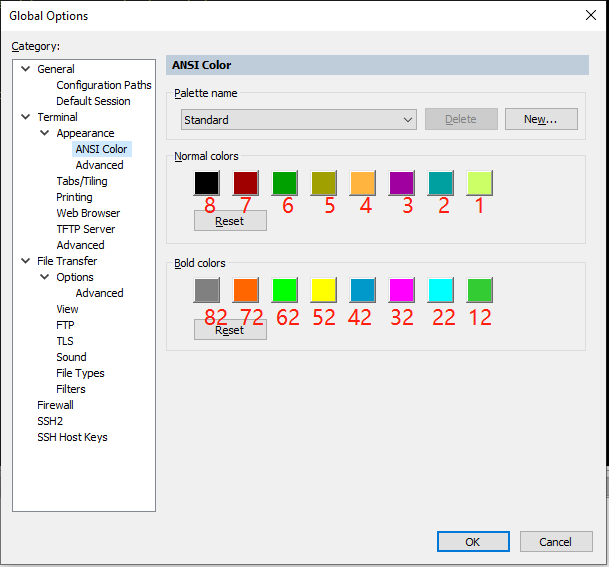

# <font color=#69D600>SecureCRT Configuration</font>

[TOC]

平台：Windows

#### Sessions 配置文件位置

C:\Users\songye\AppData\Roaming\VanDyke\Config\Sessions

#### 全局选项配置 Global Options:

General -> Default Session -> Edit Default Settings...

 

编辑默认设置，图片仅供参考

 

Terminal -> Emulation

Emulation -> Terminal: Linux  select ANSI Color	// 勾选 ANSI Color

Size -> Logical rows: 36		// 终端高度，根据显示器和使用习惯设置

Size -> Logical columns: 160	// 终端宽度，根据显示器和使用习惯设置

Scrollback -> Scrollback buffer: 50000	// 回滚缓冲区，最大128000，50000差不多了

\# 配色 ANSI Color

 

Terminal -> Appearance -> ANSI Color

```
 1: 204 255 102		备用 191 255 128
12: 51 204 51		备用 64 255 0
42: 0 153 204		备用 255 155 106
72: 255 102 0
62: 0 255 0
红色备用 255 0 51
土黄备用 255 204 0
```

 


```
new
 1: 132 193 56
12: 245 245 245
22: 0 232 232
32: 232 0 232
42: 40 90 200
52: 232 232 88
62: 32 188 32
72: 232 0 0
82: 128 128 128

```


```
Windows Registry Editor Version 5.00

[HKEY_CURRENT_USER\Software\SimonTatham\PuTTY\Sessions\Hipster Green]
"Colour0"="132,193,56"
"Colour1"="0,219,0"
"Colour2"="16,11,5"
"Colour3"="16,11,5"
"Colour4"="255,0,24"
"Colour5"="35,255,24"
"Colour6"="0,0,0"
"Colour7"="102,102,102"
"Colour8"="182,33,74"
"Colour9"="229,0,0"
"Colour10"="0,166,0"
"Colour11"="134,169,62"
"Colour12"="191,191,0"
"Colour13"="229,229,0"
"Colour14"="36,110,178"
"Colour15"="0,0,255"
"Colour16"="178,0,178"
"Colour17"="229,0,229"
"Colour18"="0,166,178"
"Colour19"="0,229,229"
"Colour20"="191,191,191"
"Colour21"="229,229,229"
```


### DONE


