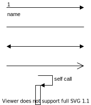

# <font color=#69D600>UML类图</font>

[TOC]

### UML

​		统一建模语言	UML	Unified Modeling Language

​		一种为面向对象系统的产品进行说明、可视化和编制文档的一种标准语言，是非专利的第三代建模和规约语言。UML是面向对象设计的建模工具，独立于任何具体程序设计语言。

​		UML 从目标系统的不同角度出发，定义了用例图、类图、对象图、状态图、活动图、时序图、协作图、构件图、部署图等 9 种图。

​		本文档只是类图基础。包含类与类之间的关系知识。


### UML类图基础

​		类图 Class Diagram

#### 可见性：

```
+	// public
-	// private
#	// protected
_	// static
~	// default，也就是包权限，空也是 default
斜体	// 斜体 抽象
```


#### 类名 Name：

​		字符串，如 Animal


#### 属性 Attribute：

​		指类的特性，即类的成员变量。格式：

> [可见性] 属性名:数据类型


#### 操作 Operation：

​		类的任意一个实例对象都可以使用的行为，是类的成员方法。格式：

> [可见性] 方法名(参数列表)[: 返回类型]

​		表格示例：

| 类名 | Animal                                 | 格式                                 | 说明                                          |
| ---- | :------------------------------------- | ------------------------------------ | --------------------------------------------- |
| 属性 | - runSpeed: double                     | 可见性 属性名: 数据类型              |                                               |
| 方法 | + setRunSpeed(double speed): void      | 可见性 方法名(参数类型 形参): 返回值 | 返回值为空可简写：+ setRunSpeed(double speed) |
| 方法 | + getRunSpeed(double distance): double | 可见性 方法名(参数类型 形参): 返回值 |                                               |

​		类图示例：单个类

 


#### 类之间的关系

##### 依赖 Dependency

​		**定义：**对于两个相对独立的对象，当一个对象负责构造另一个对象的实例，或者依赖另一个对象的服务时，这两个对象之间主要体现为依赖关系。

​		依赖关系是一种使用 `uses-a` 关系，它是对象之间耦合度最弱的一种关联方式，具有偶然性、临时性的关联。

​		在代码中，某个类的方法通过局部变量、方法的参数或者对静态方法的调用来访问另一个类（被依赖类）来完成一些职责。

```java
class Driver {
    // 通过局部变量实现依赖关系
    public void drive2() {
		Car car = new Car();
		car.run();
    }
    // 通过形参实现依赖关系
    public void drive1(Car car) {
		car.run();
    }
    // 通过静态变量、方法实现依赖关系
    public void drive3() {
        Car.MAX_SPEED;
		Car.run();
    }
}
```

​		比如常用的 Arrays.asList(T)、Thread.sleep(1000)，便依赖 Arrays 类的静态 `asList()` 方法、Thread 类的静态 `sleep()` 方法。

​		类图中使用带箭头的虚线

  


##### 关联 Association

​		**定义：**对于两个相对独立的对象，当一个对象的实例与另一个对象的一些特定实例存在固定的对应关系时，这两个对象之间为关联关系。

​		关联关系是一种引用 `has-a` 关系，是一种强依赖关系，一般是长期性的关系。

​		关联关系按耦合度可分为一般关联关系、聚合关系和组合关系，按引用关系可分为单向关联、双向关联和自关联。

​		一般关联关系中，司机和汽车可以为单向关联，老师和学生可以为双向关联，数据结构的链表为自关联。

```java
class Driver {
    // 使用成员变量实现关联关系
    private Car car;
    public void drive() {
		car.run();
    }
}
class Car {
    public void run(){}
}
```

​		类图中使用带箭头的实线

  

​		引用关系还具有多重性，包括一对一、一对多、多对一、 多对多。类图中：

| 关系 | 说明        | description                      |
| ---- | :---------- | -------------------------------- |
| 1    | 1个         | Exactly one, no more and no less |
| 0..1 | 0个或者1个  | Zero or one                      |
| *    | 多个        | Many                             |
| 0..* | 0个或者多个 | Zero or many                     |
| 1..* | 1个或者多个 | one or many                      |


##### 聚合 Aggregation

​		聚合关系是整体和个体  `has-a`  的关系。是关联关系的一种，耦合度强于关联。关联关系的两个类处于同一层次上，而聚合关系两个类处于不同的层次，一个是整体，一个是部分。

​		在代码实现聚合关系时，成员对象通常作为构造方法、setter方法或业务方法的参数注入到整体对象中。

​		司机和车作为一个整体，车是整体的一部分。

```java
class Driver {
    // 成员变量
    private Car car;
    public void drive() {
		car.run();
    }
    // setter 注入成员对象实现聚合关系
    public void setCar(Car c){
		car = c;
    }
}
class Car {
    public void run(){}
}
```

​		类图中使用带空心菱形的实线

  


##### 组合 Composition

​		组合关系也是整体和部分 `contains-a` 的关系，但是在组合关系中部分和整体具有统一的生存期，一旦整体对象不存在，成员对象也将不存在。也是关联关系的一种，耦合度比聚合关系更强。

​		司机和车作为一个整体，车是整体的一部分，司机需要有车，才能开车。没有司机或没有车，都不能完成开车。

```java
class Driver {
    private Car car;
    // 使用构造初始化成员对象实现组合关系
    public Driver(Car car) {
		this.car = car;
    }
    public void drive() {
		car.run();
    }
}
class Car {
    public void run(){}
}
```

​		类图中使用带实心菱形的实线

   


##### 聚合和组合的区别：

​		聚合关系是  `has-a`  关系，组合关系是 `contains-a` 关系；

​		聚合关系表示整体与部分的关系比较弱，而组合比较强；

​		聚合关系中代表部分事物的对象与代表聚合事物的对象的生存期无关，一旦删除了聚合对象不一定就删除了代表部分事物的对象。组合中一旦删除了组合对象，同时也就删除了代表部分事物的对象。


##### 泛化 Generalization	继承

​		泛化关系也就是继承关系，用于描述父类与子类之间的关系，父类又称作基类或超类，子类又称作派生类。

​		汽车是父类，公交继承了汽车，同时公交可以打广告。

```java
class Car {
    public void run(){}
}
class Bus extends Car {
	public void advertise(){}
}
```

​		类图中使用带空心三角箭头的实线

  


##### 实现 Realization	Implementation

​		接口在 Java 编程语言中是一个抽象类型，是抽象方法的集合，接口通常以 interface 来声明。一个类通过继承接口的方式，从而来继承接口的抽象方法。

​		Java 里面由于不允许多重继承，所以如果要实现多个类的功能，则可以通过实现多个接口来实现。

​		公交实现汽车接口，实现具体怎么 run。

```java
interface ICar {
    public void run();
}
class Bus implements ICar {
	public void run(){}
}
```

​		类图中使用带空心三角箭头的虚线

  


### DONE

