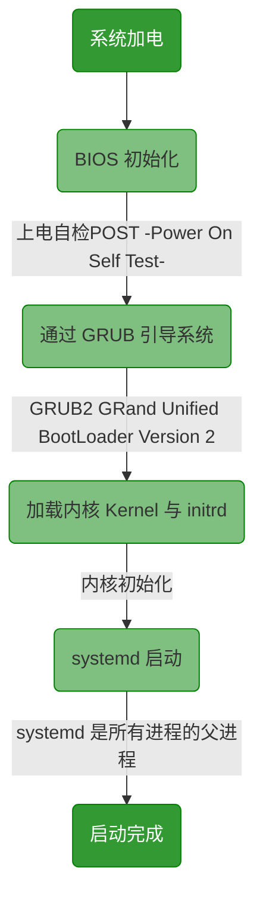

# <font color=#69D600>Linux Initialization</font>

[TOC]

### 平台 Linux

最初环境：最小化安装	Minimal Install	其他默认能选的最小化安装


## 开启远程控制权限

### 启用 root 用户

​		部分系统桌面版默认禁用 root 用户，这里启用。


#### 添加 root 密码

​		添加密码即可尝试登录。

```
sudo passwd root
```

#### 启用 root

> Note: 目前仅发现 Ubuntu 需要配置。

```perl
###!File	/usr/share/lightdm/lightdm.conf.d/50-ubuntu.conf
# Ubuntu 有配置文件 Ubuntu 20 LTS
# use cat or echo
cat >> /usr/share/lightdm/lightdm.conf.d/50-ubuntu.conf <<EOF
greeter-show-manual-login=true
EOF
# or
echo greeter-show-manual-login=true >> /usr/share/lightdm/lightdm.conf.d/50-ubuntu.conf

# check
cat /usr/share/lightdm/lightdm.conf.d/50-ubuntu.conf

###!File	/etc/pam.d/gdm-autologin
###!File	/etc/pam.d/gdm-password
# 其他 Linux 可尝试查看 /etc/pam.d/ 是否存在 gdm-autologin、gdm-password 等类似文件，grep 关键字 root
# 要添加注释的行
vi /etc/pam.d/gdm-autologin
auth required pam_succeed_if.so user != root quiet_success
vi /etc/pam.d/gdm-password
auth required pam_succeed_if.so user != root quiet_success
```

#### 命令行启动

​		非个人使用不需要桌面系统，切换至命令行启动。个人使用也可以切回来。

​		可以修改 systemd 默认 target，生成 symlink。

> Note: 需要方便快捷、频繁切换的，可以使用这个方法

```perl
###!Link	/etc/systemd/system/default.target
###!File	/lib/systemd/system/multi-user.target
###!File	/lib/systemd/system/graphical.target
# multi-user 命令行界面
systemctl set-default multi-user.target
# graphical 桌面图形界面
systemctl set-default graphical.target
```

​		对于 grub2 引导的系统，也可以修改 grub 文件。

> Note: 修改 grub 文件会使 systemd 的 symlink 失效。
>
> found "3" on the kernel commandline, which overwrides the default unit.

```perl
###!File	/etc/default/grub
# Quiet = Don't show terminal output unless an error occurs.
# Splash = Show Splash Theme if available.
# quiet splash 3 命令行界面
# quiet splash 5 桌面图形界面
vi /etc/default/grub
GRUB_CMDLINE_LINUX_DEFAULT="quiet splash 3"

###!File	/boot/grub/grub.cfg
# run 'update-grub' afterwards to update /boot/grub/grub.cfg.
update-grub
# update-grub command not found...
grub2-mkconfig -o /boot/grub2/grub.cfg
```

系统启动流程图大概如下


```perl
# 查看系统 bootup 流程
man bootup

# 系统启动加载的服务 systemctl enable 生成的软连接
/etc/systemd/system/multi-user.target.wants/

# 硬盘 mount 映射文件
###!File	/etc/fstab
# 硬盘分区情况
lsblk
fdisk -l

```


### 安装 SSH

#### 查看和安装 openssh

```perl
# 查看是否已安装 openssh，具体命令根据系统提供或自行安装
apt list --installed | grep openssh
yum list installed | grep openssh
rpm -qa | grep openssh
pacman -Ss openssh

# 安装 openssh
apt install -y openssh-server openssh-client
dnf install -y openssh-server openssh-client
yum install -y openssh-server openssh-client
rpm -ivh openssh
yes | pacman -S openssh

# 安装 vim
apt install -y vim
dnf install -y vim
yum install -y vim
rpm -ivh vim
yes | pacman -S vim

######## ps. #########
# arch 忘记安装 dhcpcd，无法联网，重新进安装盘安装
mount /dev/sda4 /mnt
mount /dev/sda1 /mnt/boot
arch-chroot /mnt
yes | pacman -S dhcpcd
exit
umount -R /mnt
reboot
# 重新进入系统查看现有网卡，配置动态网络 dhcpcd，测试网络
ip link show
dhcpcd ens33
# 开机启动 dhcpcd，生成对应 symlink
systemctl enable dhcpcd@ens33

###!File	/etc/network/interfaces
# Debian 专家模式安装好系统没有网络，编辑 interfaces 文件配置动态网络 dhcp
cat >> /etc/network/interfaces <<EOF
auto ens33
iface ens33 inet dhcp
allow-hotplug ens33 
EOF

# CentOS Minimal Install 也没有启用网卡，使用 nmcli 启用
nmcli n on
######## ps. #########
```

#### 配置 openssh

```perl
###!File	/etc/ssh/sshd_config
vim /etc/ssh/sshd_config

// 去除注释并修改
#LoginGraceTime 2m
#PermitRootLogin prohibit-password
#StrictModes yes
LoginGraceTime 2m
PermitRootLogin yes
StrictModes yes
```

#### 重启 sshd 服务

```perl
# 具体命令根据系统提供或自行安装
systemctl restart sshd
service sshd restart

# 开机启动
systemctl enable sshd

# Check the current sshd status:
service sshd status

# Start sshd service:
service sshd start

# Set sshd autostart on system startup
chkconfig sshd on

# List the current autostart status
chkconfig --list | grep sshd
```


## 常规配置

### 命令别名

​		为了让命令更加简便，给常规需要添加参数的命令设置别名。

​		一般而言命令别名放 profile 或 bashrc 都可以。

> Note: 先检查当前系统命令别名，避免重复别名和覆盖别名。
>
> 优先级应该是 ~/ > /etc/profile.d/ > /etc/

```perl
# 全局
###!File	/etc/profile
###!File	/etc/bashrc or /etc/bash.bashrc 	// 不推荐修改
###!Dir 	/etc/profile.d/ 	// 自定义 custom.sh
# 个人
###!File	~/.profile or ~/.bash_profile
###!File	~/.bashrc

# Debian10
cat >> /etc/profile.d/colorls.sh <<EOF
# You may uncomment the following lines if you want \`ls\` to be colorized:
alias ls='ls --color=auto' 2>/dev/null
alias ll='ls -l --color=auto' 2>/dev/null
alias l.='ls -d .* --color=auto' 2>/dev/null
alias l='ls -lA --color=auto' 2>/dev/null
alias lsf='ls -F --color=auto' 2>/dev/null
alias llf='ls -lAF --color=auto' 2>/dev/null

# Some more alias to avoid making mistakes:
alias rm='rm -i'
alias cp='cp -i'
alias mv='mv -i'
EOF

cat >> /etc/profile.d/colorgrep.sh <<EOF
# color-grep initialization
# /usr/libexec/grepconf.sh -c || return 	: No such file or directory
alias grep='grep --color=auto' 2>/dev/null
alias egrep='egrep --color=auto' 2>/dev/null
alias fgrep='fgrep --color=auto' 2>/dev/null

# [ -f /usr/libexec/grepconf.sh ] || return
# /usr/libexec/grepconf.sh -c || return
alias zgrep='zgrep --color=auto' 2>/dev/null
alias zfgrep='zfgrep --color=auto' 2>/dev/null
alias zegrep='zegrep --color=auto' 2>/dev/null

# /usr/libexec/grepconf.sh -c || return
alias xzgrep='xzgrep --color=auto' 2>/dev/null
alias xzegrep='xzegrep --color=auto' 2>/dev/null
alias xzfgrep='xzfgrep --color=auto' 2>/dev/null

EOF

# colorls.sh 追加别名
cat >> /etc/profile.d/colorls.sh <<EOF
alias l='ls -lA --color=auto' 2>/dev/null
alias lsf='ls -F --color=auto' 2>/dev/null
alias llf='ls -lAF --color=auto' 2>/dev/null
EOF

```


### 主机名	网络

> 阿里云 Ecs 实例名称及主机名称
>
> 实例名称命名规则：
>
> - 长度为 [2, 128] 个英文或中文字符，必须以大小字母或中文开头，可以包含数字、点号（.）、半角冒号（:）、下划线（_）或短横线（-）。
> - 如果没有指定该参数，默认值为实例的 `InstanceId`。
> - 不能以 http:// 和 https:// 开头。
>
> 云服务器主机名称命名规则：
>
> - 点号（.）和短横线（-）不能作为 HostName 的首尾字符，不能连续使用。
> - Windows 实例：名字符长度为 [2, 15]，允许字母（不限制大小写）、数字和短横线（-）组成，不支持点号（.），不能全是数字。
> - 其他类型（Linux 等）实例：字符长度为 [2, 128]，允许支持多个点号，点之间为一段，每段允许字母（不限制大小写）、数字和短横线（-）组成。

​		以上摘自阿里云，但主机名不建议加点号，踩过坑会导致某些应用无法正常运行。

​		命名规范，类似 Java 变量。

```perl
###!File	/etc/hostname
# 查看主机名，主要文件 /etc/hostname
cat /etc/hostname
sysctl kernel.hostname
echo $HOSTNAME
hostname

# 修改主机名，需重启生效。可与 sysctl kernel.hostname= 或 hostname 命令结合使用不重启
echo newHostname > /etc/hostname
###!File	/proc/sys/kernel/hostname
# 临时生效，重启无效，对应文件 /proc/sys/kernel/hostname
sysctl kernel.hostname=newHostname
hostname newHostname

# domainname 临时设置
domainname newDomainname
hostname -y newDomainname
nisdomainname newDomainname

###!File	/etc/hosts
# 根据 hostname domainname 调整
vim /etc/hosts
127.0.0.1   localhost
::1         localhost
127.0.1.1   hostname.domainname hostname

###!File	/etc/sysconfig/network-scripts/ifcfg-ens33
###!File	/etc/network/interfaces
###!File	/etc/resolv.conf 
# resolv.conf dhcp 模式下一般会自动生成该文件
# 查看网卡信息
ip addr
nmcli d show
# 网卡连接状态
nmcli d status
# 查看具体网络管理工具
ps -ef | grep etwork


# Debian10 
# Debian10 安装配置网络提示缺少固件 iwlwifi-7260-17.code，没有无线网卡驱动，安装系统后不能连接 WiFi
# iwlwifi 是非自由软件，不包含在 Debian10 安装盘里，需要修改 apt 源才能下载安装 iwlwifi
# 貌似 Linux 发行版一般都不带 WiFi，需要自行安装驱动或管理器
###!File	/etc/apt/sources.list
# 添加源，并在行尾加 non-free 以包含非自由软件，如
deb http://源地址 main 其他参数 non-free

# 安装 iwlwifi
apt install -y iwlwifi
reboot

###!File	/etc/network/interfaces
###!File	/etc/init.d/networking
# 网络配置文件
cat >> /etc/network/interfaces <<EOF
# eno1 有线
auto eno1
allow-hotplug eno1
iface eno1 inet dhcp

# wlan wifi
auto wlp2s0
iface wlp2s0 inet dhcp
wpa-ssid wifiname
wpa-psk	wifipasswork
EOF

###!File	/lib/systemd/system/networking.service
# 开机启动慢，分析
systemd-analyze blame
    1min 38.527s networking.service
           916ms ifupdown-pre.service
# networking.service 太耗时，修改 TimeoutStartSec=5min，但目前修改后由于时间不足无法连上 WiFi
vim /lib/systemd/system/networking.service
TimeoutStartSec=10s

# 重启网络服务
/etc/init.d/networking restart
systemctl restart networking

```


### 区域/语言	日期/时间

**Locale|Region**	**Time & Date**

```perl
###!File	/etc/locale.gen
###!File	/etc/locale.conf
###!File	/etc/default/locale
###!Dir 	/etc/profile.d/
###!Dir 	/usr/lib/locale
###!Dir 	/usr/share/locales
###!Dir 	/usr/share/i18n/locales
# 区域设置	Localization
# 查看当前具体 区域设置
locale
localectl
# Edit /etc/locale.gen and uncomment en_US.UTF-8 UTF-8 and other needed locales. Generate the locales by running:
# 修改 /etc/locale.gen 文件，取消注释 en_US.UTF-8 UTF-8 和其他需要的区域语言，然后使用命令生成区域语言
vim /etc/locale.gen
locale-gen
# 指定语言
locale-gen en_US.UTF-8
# 安装语言包
/usr/share/locales/install-language-pack en_US
yum install -y langpacks-zh_CN

# 部分系统设置 LANG
localectl set-locale LANG=en_US.UTF-8

# 创建 /etc/locale.conf，并设置 LANG 变量
echo LANG=en_US.UTF-8 > /etc/locale.conf
cat /etc/locale.conf

# 在 /etc/profile.d/ 添加文件 locale.sh
echo ". /etc/locale.conf" > /etc/profile.d/locale.sh
cat /etc/profile.d/locale.sh

# 直接编辑 /etc/default/locale 将 zh_CN 替换为 en_US
vi /etc/default/locale
:%s/zh_CN/en_US/g

# Time & Date
# 查看 日期/时间 状态
timedatectl

# 没有同步网络时间 ntp 的设置同步 true|false yes|no
timedatectl set-ntp yes

# 如果 Failed to set ntp: NTP not supported
# 安装 NTP，同时 chrony 也装好了，装完 timedatectl set-ntp yes
yum install -y ntpstat
apt install -y ntpstat

###!Link	/etc/localtime
###!Dir 	/usr/share/zoneinfo
###!File	/etc/adjtime
# 查看、设置 时区 软连接，
ll /etc/localtime
ln -sf /usr/share/zoneinfo/Region/City /etc/localtime

# Run hwclock to generate /etc/adjtime
hwclock --systohc

```


### 用户管理


​		最小化安装系统后，只配置 root 用户情况下。

```perl
###!File	/etc/group
# 查看 1、3 列，组名、组 id
awk -F':' '{ print $1,$3}' /etc/group
# 查看 1-3 列，组名、密码、组 id
cut -d: -f1-3 /etc/group
# 查看 组名
compgen -g

cat /etc/group

grep dev /etc/group | awk -F: '{print $1}'

```

#### 添加用户组

```
groupadd dev
groupadd pro
groupadd test

```


#### 查看用户

```perl
###!File	/etc/passwd
# 查看 1、3 列，用户名、组 id
awk -F':' '{ print $1,$3}' /etc/passwd
# 查看 1-3 列，用户名、密码、组 id
cut -d: -f1-3 /etc/passwd
# 查看 用户名
compgen -u

cat /etc/passwd | grep 1000

```


#### 添加用户

```perl
useradd -d /home/dev -g dev -G test dev
useradd -d /home/pro -g pro pro
useradd -d /home/test -g test test
# 没有用户 songye 的时候
useradd -d /home/songye -g dev -G pro,test songye

# 查看各组情况
egrep -e "dev|pro|songye" /etc/passwd
egrep -e "dev|pro|test" /etc/group

# 用户所属组如果不正常重新修改
usermod -g dev -G pro,test songye
usermod -g dev -G test dev
usermod -g pro pro

```


#### 添加用户密码
```perl
passwd dev
dev123
passwd pro
pro123
passwd test
test123

# 没有用户 songye 的时候
passwd songye
songye

```


### 防火墙设置

#### 防火墙相关

​		firewalld

```perl
###!Dir 	/usr/lib/firewalld
###!Dir 	/etc/firewalld
###!File	/etc/firewalld/firewalld.conf
###!File	/etc/firewalld/lockdown-whitelist.xml
# Default/Fallback configuration in /usr/lib/firewalld
# System configuration settings in /etc/firewalld
# /usr/bin/firewall-config No such file or directory

# 安装 firewalld
apt install -y firewalld

# 查看 firewalld 状态
firewall-cmd --state

# 获取默认 zone
firewall-cmd --get-default-zone

# 列出 public 的端口
firewall-cmd --zone=public --list-ports

# 查看某服务是否允许通过防火墙
firewall-cmd --zone=public --query-service=ssh

# 开放服务
firewall-cmd --permanent --zone=public --add-service=ssh
firewall-cmd --permanent --zone=public --add-service=http
firewall-cmd --permanent --zone=public --add-service=https

# 开放端口
firewall-cmd --zone=public --add-port=21/tcp --permanent
firewall-cmd --zone=public --add-port=22/tcp --permanent
firewall-cmd --zone=public --add-port=80/tcp --permanent
firewall-cmd --zone=public --add-port=8080/tcp --permanent
firewall-cmd --zone=public --add-port=2375/tcp --permanent
firewall-cmd --zone=public --add-port=3375/tcp --permanent
firewall-cmd --zone=public --add-port=4001/tcp --permanent
firewall-cmd --zone=public --add-port=7001/tcp --permanent

firewall-cmd --zone=public --add-port=3306/tcp --permanent
firewall-cmd --zone=public --add-port=5601/tcp --permanent
firewall-cmd --zone=public --add-port=5672/tcp --permanent
firewall-cmd --zone=public --add-port=6379/tcp --permanent
firewall-cmd --zone=public --add-port=8066/tcp --permanent
firewall-cmd --zone=public --add-port=8081/tcp --permanent
firewall-cmd --zone=public --add-port=8180/tcp --permanent
firewall-cmd --zone=public --add-port=8200/tcp --permanent
firewall-cmd --zone=public --add-port=8888/tcp --permanent
firewall-cmd --zone=public --add-port=8899/tcp --permanent
firewall-cmd --zone=public --add-port=9000/tcp --permanent
firewall-cmd --zone=public --add-port=9092/tcp --permanent
firewall-cmd --zone=public --add-port=9200/tcp --permanent
firewall-cmd --zone=public --add-port=9300/tcp --permanent

# 重新加载
firewall-cmd --reload

# iptables
iptables -P FORWARD ACCEPT
iptables -nL

# SELinux
sestatus
getenforce
setenforce 0

```


#### 端口相关

​		netstat -tunlp 用于显示 tcp，udp 的端口和进程等相关信息

​			-t 显示 tcp 相关信息

​			-u 显示 udp 相关信息

​			-n 显示 IP	don't resolve names

​			-l 监听状态端口显示 Listen 状态	 display listening server sockets

​			-p 显示建立这些连接的程序名	display PID/Program name for sockets

```perl
# 安装 net-tools
apt install -y net-tools
yum install -y net-tools

# 显示 tcp，udp 的端口和进程等相关信息
netstat -tunlp

```


### 安装 Docker

​		CentOS 详见 [DockerInstall.md](../../../03_linux_install/DockerInstall.md)

​		Ubuntu 安装

```perl
# Uninstall old versions
apt-get remove docker docker-engine docker.io containerd runc

# Set up the repository
# 1.Update the apt package index and install packages to allow apt to use a repository over HTTPS:
apt-get install -y apt-transport-https ca-certificates curl gnupg lsb-release
# 2.Add Docker’s official GPG key:
curl -fsSL https://download.docker.com/linux/ubuntu/gpg | sudo gpg --dearmor \
  -o /usr/share/keyrings/docker-archive-keyring.gpg
# 3.Use the following command to set up the stable repository. 
echo "deb [arch=amd64 signed-by=/usr/share/keyrings/docker-archive-keyring.gpg] https://download.docker.com/linux/ubuntu \
  $(lsb_release -cs) stable" | sudo tee /etc/apt/sources.list.d/docker.list > /dev/null

# Install Docker Engine
apt-get install docker-ce docker-ce-cli containerd.io
# ERROR
Package docker-ce is not available, but is referred to by another package.
This may mean that the package is missing, has been obsoleted, or
is only available from another source

E: Package 'docker-ce' has no installation candidate
E: Unable to locate package docker-ce-cli
E: Unable to locate package containerd.io
E: Couldn't find any package by glob 'containerd.io'
E: Couldn't find any package by regex 'containerd.io'

# 列出 docker 相关应用
apt list | grep docker
apt list installed | grep docker

# 安装 Docker
apt-get update
apt install -y docker docker.io

# 查看版本
docker -v
docker version

###!File	/usr/bin/docker-compose
docker-compose --version

cp docker-compose-Linux-x86_64 /usr/local/bin/docker-compose
chmod +x /usr/local/bin/docker-compose

ln -s /usr/local/bin/docker-compose /usr/bin/docker-compose

docker-compose --version


```


### DONE