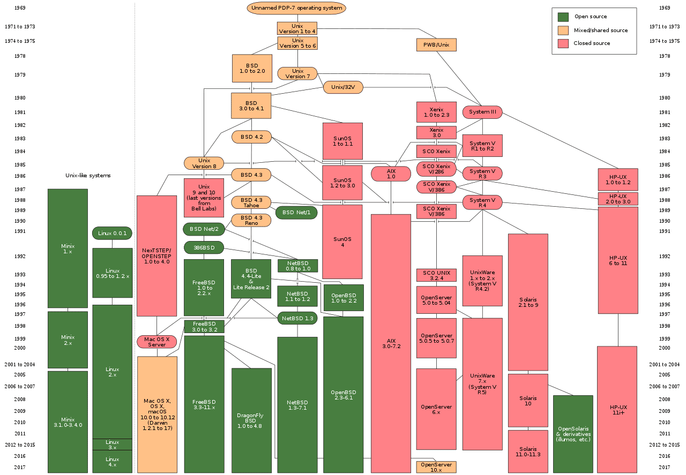

# Linux

[TOC]

### Linux	[content](00_Linux.md)

### 简介

#### Unix

​		UNIX（Uniplexed Information and Computing Service，UnICS），非复用信息和计算机服务，综合信息与计算服务

​		一种多用户、多进程的计算机操作系统，源自于从 20 世纪 70 年代开始在美国 AT&T 公司的贝尔实验室开发的 AT&T Unix。

​		开发者：贝尔实验室的 肯·汤普逊，丹尼斯·里奇，布莱恩·柯林汉，道格拉斯·麦克罗伊，乔伊·欧桑纳

​		UNIX操作系统，是一个强大的多用户、多任务操作系统，支持多种处理器架构，按照操作系统的分类，属于分时操作系统，最早由肯·汤普逊、丹尼斯·里奇和道格拉斯·麦克罗伊于 1969 年在 AT&T 的贝尔实验室开发。目前它的商标权由国际开放标准组织所拥有，只有符合单一 UNIX 规范的 UNIX 系统才能使用 UNIX 这个名称，否则只能称为 类 UNIX（UNIX-like）。

##### Unix之父、C语言之父

​		**肯尼斯·蓝·汤普逊	Kenneth Lane Thompson**

​		1943 年 2 月 4 日－

​		小名 **肯·汤普逊**（Ken Thompson）

​		美国计算机科学学者和工程师。黑客文化圈子通常称他为 “ken”。在贝尔实验室工作期间，汤普逊设计和实现了 Unix 操作系统。他创造了 B 语言—— C 语言的前身，而且他是 Plan 9 操作系统的创造者和开发者之一。2006 年，汤普逊进入 Google 公司工作，与他人共同设计了 Go 语言。他与 **丹尼斯·里奇** 同为 1983 年图灵奖得主。

​		此外，肯·汤普逊还参与过正则表达式和 UTF-8 编码的设计，改进了文本编辑器 QED（QED (text editor)），创造了 ed 编辑器。他曾制造过专门用于下国际象棋的电脑 “Belle（Belle (chess machine)）”，并创建了残局数据库（Endgame tablebase）。

​		**丹尼斯·麦卡利斯泰尔·里奇	Dennis MacAlistair Ritchie**

​		1941 年 9 月 9 日－2011 年 10 月 12 日

​		美国计算机科学家。黑客圈子通常称他为 “dmr”。他是 C 语言的创造者、Unix 操作系统的关键开发者，对计算机领域产生了深远影响，并与 **肯·汤普逊** 同为1983 年图灵奖得主。

##### UNIX版本

**Oracle Solaris：**

​		Solaris 原先是太阳微系统公司研制的 Unix 操作系统，在 Sun 公司被 Oracle 并购后被称作 Oracle Solaris。目前最新版为 Solaris 11。早期的 Solaris 是由 BSDUnix 发展而来。这是因为太阳公司的创始人之一，比尔·乔伊（Bill Joy）来自柏克莱加州大学（U.C.Berkeley）。但是随着时间的推移，Solaris 现在在接口上正在逐渐向 System V 靠拢。

**Open Solaris：**

​		2005 年 6 月 14 日，Sun 公司将正在开发中的 Solaris 11 的源代码以 CDDL 许可开放，这一开放版本就是 OpenSolaris。2010 年 8 月 23 日，OpenSolaris 项目被 Oracle 中止，由社区发起的 Illumos 计划继承，随后开放源码社区以原本的代码为基础，分支出新的计划：OpenIndiana 和 Illumos。

​		Illumos 项目的主要目标是建构一个开源的且与 Solaris 完全兼容的 SunOS 内核操作系统，并成为其他 OpenSolaris 发行版的基础。Illumos 项目底下的 OpenSolaris 发行版项目：OpenIndiana 就是创建在 Illumos 内核。Illumos 提供与 SunOS 兼容的内核，OpenIndiana 则在此内核上建构发行版。

**IBM AIX：**

​		AIX，是 IBM 专有 UNIX 操作系统的商标名。名称来自先进交互运行系统（Advanced Interactive eXecutive）。最初的名称来自英语：Advanced IBM Unix，但或许这个名字没有得到法律部门的允许，因此更改为 "Advanced Interactive eXecutive"。

​		AIX 的一些流行特性例如 chuser、mkuser、rmuser 命令以及相似的东西允许如同管理文件一样来进行用户管理。AIX 级别的逻辑卷管理正逐渐被添加进各种自由的 UNIX 风格操作系统中。

**HP-UX：**

​		HP-UX（Hewlett Packard UniX）是惠普科技（HP, Hewlett-Packard）以 System V 为基础所研发成的类 UNIX 操作系统。HP-UX 可以在 HP 的 PA-RISC 处理器、Intel 的 Itanium 处理器的电脑上运行，另外过去也能用于后期的阿波罗电脑（Apollo/Domain）系统上。较早版本的 HP-UX 也能用于 HP 9000 系列 200 型、300 型、400 型的电脑系统（使用 Motorola 的 68000 处理器）上，和 HP-9000 系列 500 型电脑（使用 HP 专属的 FOCUS 处理器架构）。

2015 年 11 月，惠普科技将企业级产品部门分割为慧与科技（HPE, Hewlett Packard Enterprise），HP-UX 产品的开发与维护由慧与科技继承之。

##### 类 UNIX

**MINIX：**

​		一个迷你版本的类 Unix 操作系统，由塔能鲍姆教授（Prof. Andrew S. Tanenbaum）为了教学之用而创作，采用微核心设计。它启发了 Linux 核心的创作。

​		它的名称取自英语：Mini UNIX 的缩写。与 Xinu、Idris、Coherent 和 Uniflex 等类 Unix 操作系统类似，派生自 Version 7 Unix，但并没有使用任何 AT&T 的代码。第一版于 1987 年发布，只需要购买它的磁片，就提供完整的源代码给大学系所与学生，做为授课及学习之用。2000 年 4 月，重新以 BSD 许可协议发布，成为开放源代码软件。

因为 AT&T 的政策改变，在 Version 7 Unix 推出之后，发布新的使用许可协议，将 UNIX 源代码私有化，在大学中不再能使用 UNIX 源代码。塔能鲍姆教授为了能在课堂上教授学生操作系统运作的实务细节，决定在不使用任何 AT&T 的源代码前提下，自行开发与 UNIX 兼容的操作系统，以避免著作权上的争议。他以小型 UNIX（mini-UNIX）之意，将它称为 MINIX。

**FreeBSD：**

​		FreeBSD 是 FreeBSD 项目的发展成果。它是一种开放源代码的类 Unix 的操作系统，基于 BSD Unix 的源代码派生发展而来。加州大学伯克利分校在 1975 年至 1993 年开发了 BSD Unix 操作系统。FreeBSD 的许可证规定源代码开放，允许任何人自由使用，任何人都可以获得并使用它来满足各种需求，也可以修改它，然后再重发布 -- 此功能专为个人和公司量身定制，可用于创建各种基于 FreeBSD 的商业和非商业产品。尽管 FreeBSD 直接从 BSD Unix 派生，但是从法律的角度来看，它并不是 “UNIX”。因为现在 “UNIX” 商标属于国际开放标准组织，而 FreeBSD 并没有使用该商标的授权。

​		FreeBSD 支持许多硬件和体系架构。和其他 BSD 家族的操作系统一样，核心、驱动程序以及所有的用户层（Userland）应用程序（如 Unix shell 和 cat 和 ps 等命令）都存储在 FreeBSD 源代码库中。FreeBSD 也可以运行其他二进制软件，比如 Linux 的。借助 ports 和 FreeBSD 软件包管理器 pkg，用户能安装各种应用程序。根据 2005 年的调查，77％ 的 BSD 用户使用 FreeBSD，因此 FreeBSD 拥有 BSD 系列中最大的用户社区。

**NetBSD：**

​		NetBSD 是一份自由、安全的具有高度可定制性的 类 Unix 操作系统，适于多种平台，从 64 位 AMD Athlon 服务器和桌面系统到手持设备和嵌入式设备。它设计简洁，代码规范，拥有众多先进特性，使得它在业界和学术界广受好评，用户可以通过完整的源代码获得支持。许多程序都可以很容易地通过 NetBSD Packages Collection 获得。

**OpenBSD：**

​		OpenBSD 是一个 类 Unix 计算机操作系统，是加州大学伯克利分校所开发的 Unix 派生系统伯克利软件套件（BSD）的一个后继者。它是在 1995 年尾由荷裔加拿大籍项目领导者 西奥·德·若特（Theo de Raadt）从 NetBSD 分支而出。除了操作系统，OpenBSD 项目已为众多子系统编写了可移植版本，其中最值得注意的是 PF 防火墙、OpenSSH 和 OpenNTPD，作为软件包，它们在其他操作系统中随处可见。

**DragonFlyBSD：**

​		DragonFly BSD 是一套开放源代码的 类 Unix 操作系统，自 FreeBSD 4.8 分支。

​		由于 FreeBSD 开发组将于 FreeBSD 4.11 后不再推出新的 4 系列版本（仅做安全性更新），而新的 FreeBSD 5 系列初期又有性能及稳定性等等的质疑，因此 Matt Dillon 在 2003 年六月另外成立分支计划，并于同年七月时于 FreeBSD 的邮件讨论组群上公布。

​		Dillon 当时认为 FreeBSD 5 所使用的 Threading 与 SMP 架构将会使得系统难以维护，但不被 FreeBSD 的发展团队接受，于是决定自行发展分支。即便如此，DragonFly BSD 的发展团队仍与 FreeBSD 密切合作，双方仍然经常互相帮助对方修正 bug，以及驱动程序的更新。

**Mac OS：**

​		麦金塔操作系统（Macintosh operating systems）是苹果公司自 1984 年以来为麦金塔（Mac）系列电脑开发的操作系统。1984 年，苹果公司发布了最初的麦金塔系统软件，推出了现在被称为 Classic Mac OS 的操作系统。该系统在 1996 年被重命名为 “Mac OS”；2001 年，更名为 “Mac OS X”；2012 更名为 “OS X”；2016 年更名为 “macOS”。

​		Mac OS X 是在 1997 年至 2001 年苹果收购 NeXT 之后开发的，采用了基于 UNIX 的 NeXTSTEP 的全新架构，克服了 Classic Mac OS 所面临的许多技术挑战。

​		macOS 是 1999 年发行的 Classic Mac OS 最终版本 Mac OS 9 的后继者。1999 年发布 macOS Server 的首个版本 Mac OS X Server 1.0，桌面版 Mac OS X 10.0“Cheetah” 于 2001 年 3 月 24 日发布。2012 年苹果将 Mac OS X 更名为 OS X，第一个使用此命名的系统为 “OS X Mountain Lion”。以前版本的 macOS 以大型猫科动物命名，例如 Mac OS X v10.8 被称为 “Mountain Lion”，但随着 2013 年 6 月 OS X Mavericks 的公布，命名开始采用加州地标。2016 年 6 月，苹果公司宣布 OS X 更名为 macOS，以便与苹果其他操作系统 iOS、watchOS 和 tvOS 保持统一的命名风格。最新版本 macOS Big Sur 已于 2020 年 6 月 23 日发布。

##### Unix history

 

### DONE